--柏林保卫战(6.9-6.21)

‍

## Header

‍

期末考时搜集整合几篇博客, 笔记而成, 高深的区域折叠了

删除了部分考试章节中没有的部分, 同时偷懒了一点, 毕竟目的是考试 : (

‍

// 本页面更新基本完成 后期: 嵌入Python实现代码入文章

‍

### 数学知识充电

‍

1. 排列组合

    排列  $P_{n}^{r} = n(n-1)...(n-r+1) = \frac{n!}{(n-r)!}$  

    组合  $C_{n}^{r} = \frac{n!}{(n-r)!r!} = \frac{n(n-1)...(n-r+1)}{r!}$  

    ‍
2. 阶乘函数  
      
    斯特林公式：$n! \approx \sqrt[]{2 \pi n} (\frac{n}{e})^2$
3. 正整数m, n和实数$a > 0$，指数运算性质：  
      

    $e^x = 1 + x + \frac{x^2}{2!} + \frac{x^3}{3!} + ... = \sum_{i=0}^{\infty} \frac{x^i}{x!}$  

    $\lim_{n \to \infty} (1 + \frac{x}{n})^n = e^x$
4. 上下取整

    $\left \lceil x \right \rceil$ 向上取整：不小于x的最小整数  $\left \lfloor x \right \rfloor$ 向下取整：不大于x的最大整数

    ‍

    取整函数性质

    1. $x-1 < \left \lfloor x \right \rfloor \le x \le \left \lceil x \right \rceil \le x+1$
    2. $\left \lfloor n \right \rfloor + \left \lceil n \right \rceil = n$

    ‍

    对于$n \ge 0, a, b > 0$，有如下性质

    1. $\left \lceil \frac{\left \lceil \frac{n}{a} \right \rceil}{b} \right \rceil = \left \lceil \frac{n}{ab} \right \rceil = \left \lfloor \frac{\left \lfloor \frac{n}{a} \right \rfloor}{b} \right \rfloor$
    2. $\frac{a-(b-1)}{b} \le \left \lfloor \frac{a}{b} \right \rfloor \le \left \lceil \frac{a}{b} \right \rceil \le \frac{a+(b-1)}{b}$

‍

‍

# 算法

‍

### Tips

‍

## 定义

‍

### 非形式化定义

‍

算法是规则的有限集合，是为解决特定问题而规定的一系列操作。

‍

### 形式化定义

‍

算法是一个四元组，即$(Q, I, \Omega, F)$，其中：

1. Q: 包含子集I和$\Omega$的集合，表示计算状态
2. I: 计算的输入集合
3. $\Omega$: 计算的输出集合
4. F: 计算的规则，是一个由Q到它自身的函数，具有自反性，即对于任何一个元素$q \in Q, F(q) \in Q$

‍

* 算法设计：设计解决给定问题的有效算法，构造问题的解
* 算法分析：涉及分析判断某一算法质量的准则和技术，对算法进行有效性评价

‍

## 内容

‍

### 特性

1. 有限性：一个算法必须保证执行有限步之后结束
2. 确定性：算法的每一步骤必须有确切的定义，不能有歧义
3. 可行性：算法原则上能精确地运行，在现有条件下是可以实现的
4. 输入：一个算法有0个或多个输入
5. 输出：一个算法有一个或多个输出（广义输出：包括提供处理结果的多种形式），以反映对输入数据加工后的结果

‍

### 正确性证明

‍

数学归纳法，反例

‍

‍

### 复杂度

‍

复杂函数公式 C = F(N^(问题规模)^, I^(输入)^, A^(算法本身（具体计算时忽略）)^)

‍

算法空间复杂度：算法在执行过程中所占存储空间的大小，用S(n)表示【space】

‍

算法时间复杂度：算法中有关操作次数的多少，同T(n)表示【time】

* 算法执行时间 = 其中所有语句执行时间的总和 = 该条语句的执行次数 * 执行一次所需实际时间
* 语句频度：该语句在一个算法中重复执行的次数, 一个算法时间耗费就是该算法中所有语句频度之和; 在进行算法时间复杂度分析时，一般情况下不考虑常数，主要注重复杂度公式中的最高次项
* 非递归算法计算法

  1. for/while循环：循环体内计算时间 * 循环次数
  2. 嵌套循环：循环体内计算时间 * 所有循环次数
  3. 顺序语句：各语句计算时间相加
  4. if-else语句：if语句计算时间和else语句计算时间之中的**较大者**

‍

耗费时间公式：$T(N, I) = \sum_{i=1}^{k} t_i e_i (N, I)$

N: 问题规模

k: 计算机提供的元运算种类

$t_i$: 第i种运算所需的时间

$e_i$: 第i种运算次数

‍

#### 分类

‍

1. 平均时间复杂度

    ​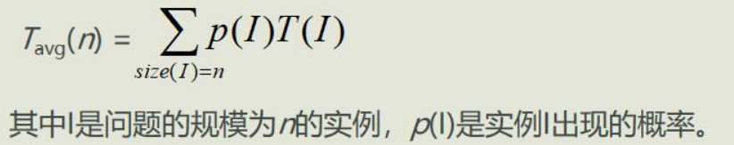​
2. 最坏时间复杂度：问题消耗的上界 $W(n) = \max_{i \in D_n} t(i) = \max\{t(i)\}, 1 \le i \le n+1$
3. 最好时间复杂度：问题的最佳性、解决问题的下界 (替换为min)

    问题下界的证明

    1. 设计算法A，找出一个函数W(n)，A至多是W(n)的上界
    2. 对于某个函数F，问题规模输入n，使算法至少运行F(n)次运算
    3. 若W和F相等，则A是最优的；若W和F不相等，则可能存在更好的算法或下界

‍

在实时系统时关注最坏情况分析，其他情况下，通常考虑平均情况

‍

‍

#### 渐进判断

‍

    当问题规模很大且趋于无穷时对算法性能的分析，其渐进时间复杂度表示为 $\lim_{n \to \infty} T(n)$, 是对算法资源开销的一种不精确的估算方法^（为大规模问题的算法资源开销评估提供了一种简化）^

‍

1. 低阶$O(上界)$

    存在一个正常数C和$n_0$，对所有的$n>n_0$，都有$f(n) \le Cg(n)$，则记作$f(n) = O(g(n))$

    ‍
2. 高阶$\Omega(下界)$

    存在一个正常数C和$n_0(C \ne 0)$，使得$\forall n \ge n_0, f(n) \ge Cg(n)$，记作$f(n) = \Omega(g(n))$

    ‍
3. 等阶$\theta$

    当且仅当$f=O(g)$且$f(n) = \Omega(g(n))$时，f(n)与g(n)同阶

‍

##### Tips

‍

1. **函数阶满足传递性**  
    ​`若f(n)在O(g(n))中且g(n)在O(h(n))中，则f(n)在O(h(n))中`​
2. 可**忽略大O表示法中的常数因子**
3. 顺序给出一个程序的多个部分，**只需考虑其中开销较大的部分**

    若$f_1(n)$在$O(g_1(n))$中且$f_2(n)$在$O(g_2(n))$中，则$f_1(n) + f_2(n)$在 O(max(g_1(n), g_2(n)))中
4. 循环中有限次重复某种开销相等的操作，总开销为**每次开销与重复次数之积**

    若$f_1(n)$在$O(g_1(n))$中且$f_2(n)$在$O(g_2(n))$中，则$f_1(n) f_2(n)$在 O(g_1(n) * g_2(n)) 中

‍

‍

#### 复杂度分析

‍

1）确定用来表示问题规模的变量；

2）确定算法的基本操作；

3）写出基本操作执行次数的函数（运行时间函数）；

4）如果函数依赖输入实例，则分情况考虑：最坏情况、最好情况、平均情况；

5）只考虑问题的规模充分大时函数的增长率，用渐近符号O 、Θ、Ω 、o 来表示。

6）常用O和Θ

‍

##### 阶证明

‍

反证法：常用于否定的论述

极限法：利用极限描述

洛必达法则常用于求极限，若$\lim_{n \to \infty} f(n) = \lim_{n \to \infty} g(n) = \infty$，则$\lim_{n \to \infty} \frac{f(n)}{g(n)} = \lim_{n \to \infty} \frac{f'(n)}{g'(n)}$

‍

‍

‍

‍

## 区别与联系

‍

### 与程序

1. 算法描述了问题处理的方式或步骤，程序采用具体语言规则实现算法的功能
2. 算法依靠程序来完成，算法是程序的灵魂
3. 程序不一定满足有穷性，一个在无限循环中执行的程序

‍

‍

## 使用

‍

### 设计流程

1. 明确问题性质并分析需求
2. 建立问题的描述模型

    1. 数值型问题 -> 建立数学模型
    2. 非数值型问题 -> 建立过程模型
3. 选择解决方法
4. 算法设计

    1. 数值型问题 -> 采用数值分析现成的经典算法
    2. 非数值型问题 -> 通过构建数据结构或算法分析设计进行处理
5. 程序化：将设计好的算法用特定的程序设计语言实现，并在具体的计算机上运行
6. 算法分析

‍

‍

### 设计准则

‍

#### 正确性

‍

    指假设给定有意义的输入，算法经有限时间计算，可产生正确答案. 最重要也是最基本的要求

‍

两方面含义：

1. 解决问题的方法选取是正确的，也就是数学上的正确性
2. 实现这个方法的一系列指令是正确的

‍

四个层次

1. 程序不含语法错误
2. 程序对几组输入数据能得出满足规格要求的结果
3. 对典型的、苛刻的、带有刁难性的几组输入有正确的结果
4. 对一切合法的输入都能产生满足规格要求的结果

‍

#### 可使用性

‍

    要求算法能够很方便地使用，这个特性也叫做用户友好性

‍

#### 可读性

‍

    算法应该易于人的理解，也就是可读性好。算法的逻辑应该是简单的、清晰的和结构化的

‍

#### 健壮性^（鲁棒性）^

‍

    程序对于规范要求以外输入情况的处理能力, 具有一定的容错性，即提供异常处理，对那些不合理的数据进行检查，不经常出现异常中断和死机现象

‍

#### 高效率和低存储量

‍

1. 效率：算法的执行时间。对于一个具体问题，执行时间短的算法运行效率高
2. 存储量：算法在执行过程中所需要的最大存储空间

算法的效率和低存储量都与问题的规模有关

‍

‍

‍

# 递归

‍

    函数、过程、子程序在运行过程中直接或间接调用自身而产生的重入现象. 描述简捷，结构清晰，算法的正确性比较容易证明. 但是执行效率低，空间消耗多，受软、硬件环境条件限制较大. 

‍

‍

### Tips

‍

1. 任何间接递归都可以等价地转换为直接递归
2. 尾递归：递归调用语句是最后一条执行语句的递归过程（函数）
3. 分为****

‍

## 原理

‍

### 概念

‍

#### 递归模型

‍

递归算法的抽象，反应一个递归问题的递归结构

1. 递归边界（递归的终止条件）
2. 递归体

‍

#### 递归出口

‍

确定递归到何时结束 $f(s_1) = m_1$  

‍

#### 递归体

‍

确定递归求解时的递推关系 $f(s_{n+1}) = g(f(s_i), f(s_{i+1}), ..., f(s_n), c_j, c_{j+1}, ..., c_n) n, i, j, m \in N^*$  

1. $s_{n+1}$: 大问题
2. $s_i、s_{i+1}、...、s_n$: 小问题
3. $c_j、c_{j+1}、...、c_m$: 若干非递归问题
4. g: 非递归函数

‍

#### 递归数学函数

‍

1. 阿克曼函数

$$
Ack(m, n) = \left\{\begin{matrix}n+1 &,m=0 \\
Ack(m-1, 1) &, m \ne 0, n = 0 \\
Ack(m-1, Ack(n, n-1)) &, m \ne 0, n \ne 0
\end{matrix}\right.
$$

2. 斐波那契数列

$$
F(n) = \left\{\begin{matrix}1 &, n = 0, 1 \\
F(n-1)+F(n-2) &, n > 1
\end{matrix}\right.
$$

‍

#### 递归数据结构

‍

采用递归方式定义的数据结构

‍

基于递归数据结构的递归算法设计示例

1. 单链表的递归算法设计

    1. 设求解以L为首结点指针的整个单链表的某功能为“大问题”
    2. 设求解除首结点外余下结点构成的单链表（由L->next标识，而该运算为递归运算）的相同功能为“小问题”。
    3. 由大小问题之间的解关系得到递归体。
    4. 考虑特殊情况，通常是单链表为空或者只有一个结点时，这时很容易求解，从而得到递归出口。
2. 二叉树的递归算法设计

    1. 设求解以b为根结点的整个二叉树的某功能为“大问题”。
    2. 转化为：求解其左、右子树的相同功能为“小问题”。
    3. 由大小问题之间的解关系得到递归体。
    4. 考虑特殊情况，通常是二叉树为空或者只有一个结点时，这时很容易求解，从而得到递归出口。

‍

#### 递归求解方法

‍

采用递归思想设计的方法

如欧几里得算法、汉诺塔问题

‍

### 分析方法

‍

    当一个算法包含对自身的递归调用过程时，该算法的运行时间复杂度可用递归方程进行描述，求解该递归方程，可得到对该算法时间复杂度的函数度量。

    (太难了, 略)

‍

## 区别与联系

‍

是一种基本的编程技巧，其他算法都是基于递归的思想来设计和实现的

‍

分治算法和动态规划算法很大程度上是递归思想基础上的解决更具体问题的两类算法思想

回溯算法和分支限界法都是在问题的解空间树上搜索问题解的算法，都可以用递归来实现

‍

## 性能

‍

优点

1. 结构清晰易读
2. 正确性容易证明

尽管递归程序在执行时间上往往比非递归程序要付出更多的代价，但有很多问题的数学模型或算法设计方法本来就是递归的, 递归过程来描述它们不仅非常自然，而且证明该算法的正确性要比相应的非递归形式容易得多。

‍

缺点

1. 时间效率低
2. 空间开销大
3. 不容易优化

‍

### master公式

‍

计算递归程序的时间复杂度

b：子过程的样本量  
a：子过程的计算次数  
O($N^d$)：子结果合并的时间复杂度

  
T(N) = aT($N/b$) + O($N^d$)

‍

log(b，a) > d ：时间复杂度为O($N$​^^)

log(b，a) = d ：时间复杂度为O($N$​^^​$* logN$)

log(b，a) < d ：时间复杂度为O($N^d$)

‍

‍

## 使用

‍

‍

### 大体方针

‍

1. 对原问题$f(s_n)$进行分析，抽象出合理的“小问题”$f(s_{n-1})$（与数学归纳法中假设n=k-1时等式成立相似）；
2. 假设$f(s_{n-1})$是可解的，在此基础上确定$f(s_n)$的解，即给出$f(s_n)$与$f(s_{n-1})$之间的关系（与数学归纳法中求证n=k时等式成立的过程相似）；
3. 确定一个特定情况（如f(1)或f(0)）的解，由此设计为递归出口（与数学归纳法中求证n=1或n=0时等式成立相似）。

‍

### 递归模板

‍

1 结束器  

2 过程:把大问题化为子问题  

3 进入子问题, 标记状态  

4 状态变化, 去掉标记

```java
public void recur(int level, int param) {

    // terminator
    if (level > MAX_LEVEL){ 
        // process result
        return;
    }

    //process current logic
    process(level, param);

    //drill down
    recur(level: level + 1, newParam);

    // restore current status
}
```

‍

‍

### 执行流程

‍

1. 自上而下的递归进层阶段（递推阶段）

    1. 保存本层参数、返回地址
    2. 分配局部数据空间、传递参数
    3. 传第一条指令
2. 自下而上的递归出层阶段（回归阶段）

    1. 恢复上层
    2. 传递结果
    3. 转断点执行

‍

函数调用

* 将**返回地址**、所有**实参**等信息传递给被调用函数保存；
* 为被调用函数的局部变量分配存储区；
* 将**控制转移**到被调用函数的入口。

‍

函数返回

* 保存被调函数的计算**结果**；
* 释放被调函数保存**局部变量**的数据区；
* 依照被调函数保存的**返回地址将控制转移**到调用函数。

‍

**实现注意**

‍

1.   在正常的情况下，随着调用的不断深入，必定会出现调用到某一层的函数时，不再执行递归调用而终止函数的执行(遇到递归出口)
2.   实现递归过程的关键在于为过程的递归调用建立一个先进后出型调用堆栈。一个过程要有一个相应的**递归调用堆栈**。递归调用是函数嵌套调用的一种特殊情况，即它是调用自身代码。也可以把每一次递归调用理解成调用自身代码的一个复制件。

      由于每次调用时，它的参量和局部变量均不相同，因而也就保证了各个复制件执行时的独立性。
3.   系统为每一次调用开辟一组存储单元，用来存放本次调用的返回地址以及被中断的函数的参量值。这些单元以系统栈的形式存放，每调用一次进栈一次，当返回时执行出栈操作，把当前栈顶保留的值送回相应的参量中进行恢复，并按栈顶中的返回地址，从断点继续执行。
4.   递归程序必须有终止条件。否则就总是自我调用，永不终止

‍

### 适合问题

‍

一般来说，能够用递归解决的问题应该满足以下三个条件

1. 需要解决的问题可以转化为一个或多个子问题来求解，而这些子问题的求解方法与原问题完全相同，只是在数量规模上不同
2. 递归调用的次数必须是有限的
3. 必须有结束递归的条件来终止递归

‍

### 转非递归

‍

#### 直接转化法

‍

用循环结构替代递归过程，不需要使用栈。

1. 尾递归：只有一个递归调用语句，而且是处于算法的最后。
2. 单向递归：递归函数中虽然有一处以上的递归调用语句，但各次递归调用语句的参数只和主调用函数有关，相互之间参数无关，并且这些递归调用语句也和尾递归一样处于算法的最后。

‍

#### 间接转化法

‍

用栈消除递归过程，通过分析只保存必须保存的信息，从而用非递归算法替代递归算法，需要使用栈。

1. 使用栈保存中间结果，从而将递归算法转化为非递归算法的过程。
2. 在设计栈时，除了保存递归函数的参数等外，还增加一个标志成员(tag)，对于某个递归小问题f(s')，其值为1表示对应递归问题尚未求出，需进一步分解转换，为0表示对应递归问题已求出，需通过该结果求解大问题f(s)。

‍

‍

## 实例

‍

### 跳台阶

‍

一只青蛙一次可以跳上1级台阶，也可以跳上2级。编写代码求青蛙跳上一个n级的台阶，总共有多少种跳法？

‍

### 瓷砖覆盖

‍

用一个2\*1的小矩形横着或竖着去覆盖更大的矩形。如用8个2\*1小矩形横着或竖着去覆盖2\*8的大矩形，覆盖方法有多少种？

‍

### 整数划分

‍

    把一个正整数n表示成一系列正整数之和：$n = n_1 + n_2 + ... + n_k (n_1 \ge n_2 \ge ... \ge n_k \ge 1)$称为正整数n的划分. 正整数n的不同划分个数称为正整数n的划分数，记作P(n)

    如果${n_1, n_2, ..., n_i}$中的最大加数s不超过m，即$s = max(n_1, n_2, ..., n_i) \le m$ ,则称它属于n的一个m划分。我们记n的m划分的个数为f(n, m)。该问题就转化为求n的所有划分个数f(n, n)

    求将正整数n无序拆分成最大数为k（称为n的k拆分）的拆分方案个数，要求所有的拆分方案不重复

‍

1. $f(1, m) = 1, m \ge 1$

    * 当n=1时，不论m的值为多少（m > 0），只有一种划分即1个1
2. $f(n, 1) = 1, n \ge 1$

    * 当m=1时，不论n的值为多少（n > 0），只有一种划分即n个1
3. $f(n, m) = f(n, n), m \ge n$

    * 最大加数s实际上不能超过n
4. $f(n, n) = 1 + f(n, n-1)$

    * 正整数n的划分是由s=n的划分和$s \le n-1$的划分构成
5. $f(n, m) = f(n, m-1) + f(n-m, m), n > m > 1$

    * 正整数n的最大加数s不大于m的划分，是由s=m的划分和$s \le m-1$的划分组成

‍

正整数n的划分数p(n) = f(n, n)

$$
f(n, m) = \left\{\begin{matrix}1 &, n = 1, m = 1 \\
f(n, n) &, n < m \\
1 + f(n, n-1) &, n = m \\
f(n, m-1) + f(n-m, m) &, n > m > 1
\end{matrix}\right.
$$

另见下面的DP优化方法

‍

# 分治

‍

    对于一个规模为n的问题：若该问题可以容易地解决（比如说规模n较小）则直接解决，否则将其分解为k个规模较小的子问题，这些子问题互相独立且与原问题形式相同，递归地解这些子问题，然后将各子问题的解合并得到原问题的解。

‍

### Tips

‍

两个特点：

1. 子问题相互独立且与原问题形式相同
2. 反复分治，使划分得到的小问题小到不可再分时，直接对其求解。

‍

> 运用分治方法时, 每一步能够淘汰**次优解**, 就变为了动态规划问题

‍

## 原理

‍

### 设计思想

‍

    将一个难以直接解决的大问题，分割成一些规模较小的相同问题（子问题是原问题的小模式，而且相互之间独立），将子问题的解合并后就可以得到原问题的解，具体可以使用递归技术来完成。

‍

## 区别与联系

‍

### 与动规

‍

相同

都要求原问题具有最优子结构性质，都将原问题分成若干个子问题，然后将子问题的解合并为原问题的解

‍

不同

分治算法是将原问题分解成若干个互不相交的子问题，而动态规划算法是分解成若干个相互重叠的子问题。分治算法避免了重复计算，而动态规划算法利用了重复计算

‍

### 与贪心

‍

相同

分治算法和贪心算法都可以用递归来实现，都是通过做出一些选择来简化原问题

‍

不同

分治算法是将原问题分解成若干个独立的子问题，而贪心算法是将原问题分解成一个非空的子问题和一个空的子问题。分治算法需要合并子问题的解，而贪心算法不需要合并

‍

## 性能

‍

采用平衡(balancing)子问题的思想

影响复杂性的主要因素：子问题个数，合并开销函数。

‍

## 使用

‍

划分，解决，合并

‍

### 大体方针

‍

分治法通常采用递归算法设计技术，在每一层递归上都有3个步骤：

1. 分解：将原问题分解为若干个规模较小，相互独立，与原问题形式相同的子问题。
2. 求解子问题：若子问题规模较小而容易被解决则直接求解，否则递归地求解各个子问题。
3. 合并：将各个子问题的解合并为原问题的解。

‍

分治法算法设计框架

```c++
divide_and_conquer(P){
   if (|P| <= n0)
      return adhoc(P); // 解决小规模的问题
   divide P into smaller subinstances P1, P2, ... Pk; // 将P分解为较小的子问题
   for (i = 1; i <= k; i++)
      yi = divide_and_conquer(Pi); // 递归解决各子问题
   return merge(y1, y2, ..., yk); // 将子问题的解合并为原问题的解
}
```

‍

‍

### 二分法

  

    大量实践发现，在用分治法设计算法时，最好使子问题的规模大致相同。即将一个问题分成大小相等的k个子问题的处理方法是行之有效的。当k=1时称为减治法。  

    许多问题可以取k=2，称为二分法，这种使子问题规模大致相等的做法是出自一种平衡子问题的思想，它几乎总是比子问题规模不等的做法要好。

‍

### 适合问题

‍

‍

1. 该问题的规模缩小到一定的程度就可以容易地解决。
2. 该问题可以分解为若干个规模较小的相同问题。（分治法的前提：反映了递归思想）
3. 利用该问题分解出的子问题的解可以合并为该问题的解。（关键，如不具备可以考虑贪心或动态规划）
4. 该问题所分解出的各个子问题是相互独立的，即子问题之间不包含公共的子问题。（涉及分治法的效率，若不独立，通常使用动态规划法）

‍

（1）缩小规模可以解决  

（2）具有最优子结构性质  

（3）子问题解可以合并  

（4）子问题相互独立

‍

## 实例

‍

### 快排

  
【基本思想】在待排序的n个元素中任取一个元素（通常取第一个元素）作为基准，把该元素放入最终位置后，整个数据序列被基准分割成两个子序列，所有小于基准的元素放置在前子序列中，所有大于基准的元素放置在后子序列中，并把基准排在这两个子序列的中间，这个过程称作划分。

然后对两个子序列分别重复上述过程，直至每个子序列内只有一个记录或空为止。

```
f(a, s, t) -> 不做任何事情 ,当a[s..t]中长度小于2
f(a, s, t) -> i = Partition(a, s, t); f(a, s, i-1); f(a, i+1, t); ,其他情况
```

【分治策略】

1. 分解：将原序列$a[s..t]$分解成两个子序列$a[s..i-1]$和a$[i+1..t]$，其中i为划分的基准位置。
2. 求解子问题：若子序列的长度为0或为1，则它是有序的，直接返回；否则递归地求解各个子问题。
3. 合并：由于整个序列存放在数组中a中，排序过程是就地进行的，合并步骤不需要执行任何操作。

‍

```python
def partition(a, s, t):  # 一次划分算法
   tmp = a[s]  # 用序列的第1个记录作为基准
   while s != t:  # 从序列两端交替向中间扫描，直至s=t为止
      while s < t and tmp <= a[t]:
         t -= 1
      a[s] = a[t]
      while s < t and a[s] <= tmp:
         s += 1
      a[t] = a[s]
   a[s] = tmp
   return s

def quicksort(a, s, t):  # 对a[s..t]元素序列进行递增排序
   if s < t:  # 序列内至少存在2个元素的情况
      p = partition(a, s, t)
      quicksort(a, s, p - 1)  # 对左子序列递归排序
      quicksort(a, p + 1, t)  # 对右子序列递归排序
```

‍

【算法分析】快速排序的时间主要耗费在划分操作上，对长度为n的区间进行划分，共需n-1次关键字的比较，时间复杂度为$O(n)$。

- 对n个记录进行快速排序的过程构成一棵递归树，在这样的递归树中，每一层至多对n个记录进行划分，所花时间为$O(n)$。
- 当初始排序数据正序或反序时，此时的递归树高度为n，快速排序呈现最坏情况，即最坏情况下的时间复杂度为$O(n^2)$；
- 当初始排序数据随机分布，使每次分成的两个子区间中的记录个数大致相等，此时的递归树高度为$\log_2n$，快速排序呈现最好情况，即最好情况下的时间复杂度为$O(n \log_2n)$。快速排序算法的平均时间复杂度也是$O(n \log_2n)$。

‍

‍

‍

### 归排

  
【基本思想】首先将$a[0..n-1]$看成是n个长度为1的有序表，将相邻的$k (k \ge 2)$个有序子表成对归并，得到n/k个长度为k的有序子表；然后再将这些有序子表继续归并，得到$n / k^2$个长度为$k^2$的有序子表，如此反复进行下去，最后得到一个长度为n的有序表。

- 若$k = 2$，即归并在相邻的两个有序子表中进行的，称为二路归并排序。
- 若$k &gt; 2$，即归并操作在相邻的多个有序子表中进行，则叫多路归并排序。

‍

#### 自底向上

‍

分治策略：循环$\left \lceil \log_2n \right \rceil$次，length依次取1、2、...、$\log_2n$。每次执行以下步骤：

1. 分解：将原序列分解成length长度的若干子序列。
2. 求解子问题：将相邻的两个子序列调用merge算法合并成一个有序子序列。
3. 合并：由于整个序列存放在数组中a中，排序过程是就地进行的，合并步骤不需要执行任何操作。

‍

```python
def merge(a, l, m, h):
   tmp = []
   i = l
   j = m+1
   while i <= m and j <= h:
      if a[i] <= a[j]:
         tmp.append(a[i])
         i += 1
      else:
         tmp.append(a[j])
         j += 1
   tmp.extend(a[i:m+1])
   tmp.extend(a[j:h+1])
   a[l:h+1] = tmp

def mergepass(a, len_, n):
   i = 0
   while i+2*len_ < n+1:
      merge(a, i, i+len_-1, i+2*len_-1)  # 归并length长的两相邻子表
      i += 2*len_
   if i + len_ < n + 1:  # 余下两个子表，后者长度小于length
      merge(a, i, i+len_-1, n-1)  # 归并这两个子表

def mergesort(a):
   len_ = 1
   while len_ < len(a):
      mergepass(a, len_, len(a))
      len_ *= 2
```

【算法分析】对于上述二路归并排序算法，当有n个元素时，需要$\left \lceil \log_2n \right \rceil$趟归并，每一趟归并，其元素比较次数不超过n-1，元素移动次数都是n，因此归并排序的时间复杂度为$O(n \log_2n)$。

‍

#### 自顶向下

‍

设归并排序的当前区间是$a[low..high]$，则递归归并的两个步骤如下：

1. 分解：将序列$a[low..high]$一分为二，即求$mid = (low + high) / 2$；递归地对两个子序列$a[low..mid]$和$a[mid+1..high]$进行继续分解。其终结条件是子序列长度为1（因为一个元素的子表一定是有序表）。
2. 求解子问题：排序两个子序列$a[low..mid]$和$a[mid+1..high]$。
3. 合并：与分解过程相反，将已排序的两个子序列$a[low..mid]$和$a[mid+1..high]$归并为一个有序序列$a[low..high]$。

‍

‍

```python
def mergesort2(a, l, h):
   if l < h:
      m = (l+h)//2
      mergesort2(a, l, m)
      mergesort2(a, m+1, h)
      merge(a, l, m, h)
```

【算法分析】设$mergesort(a, 0, n-1)$算法的执行时间为T(n)，显然$merge(a, 0, n / 2, n-1)$的执行时间为O(n)，所以得到以下递推式：

$$
\begin{align*}
T(n) &= 1 &,n = 1 \\
T(n) &= 2T(n / 2) + O(n) &,n > 1 \\
\end{align*}
$$

容易推出，$T(n) = O(n \log_2n)$。

‍

‍

‍

‍

### 最大连续子序列和

‍

给定一个有$n (n \ge 1)$个整数的序列，要求求出其中最大连续子序列的和。规定一个序列最大连续子序列和至少是0（长度为0的子序列）

‍

‍

对于含有n个整数的序列$a[0..n-1]$，若$n = 1$，表示该序列仅含一个元素，如果该元素大于0，则返回该元素；否则返回0。若$n > 1$，采用分治法求解最大连续子序列时，取其中间位置$mid = \left \lfloor (n - 1) / 2 \right \rfloor$，该子序列只可能出现3个地方。

‍

1. 该子序列完全落在左半部即$a[0..mid]$中。采用递归求出其最大连续子序列和maxLeftSum。
2. 该子序列完全落在右半部即$a[mid+1..n-1]$中。采用递归求出其最大连续子序列和maxRightSum。
3. 该子序列跨越序列a的中部而占据左右两部分。max( maxLeftSum, maxRightSum, maxLeftBorderSum+maxRightBorderSum)

‍

```python
def maxsubsum(a, l, r):
   if l == r:
      return a[l] if a[l] > 0 else 0
   m = (l + r) // 2
   maxLeftSum = maxsubsum(a, l, m)
   maxRightSum = maxsubsum(a, m + 1, r)
   maxLeftBorderSum = leftBorderSum = 0
   for i in range(m, l - 1, -1):
      leftBorderSum += a[i]
      if leftBorderSum > maxLeftBorderSum:
         maxLeftBorderSum = leftBorderSum
   maxRightBorderSum = rightBorderSum = 0
   for i in range(m + 1, r + 1):
      rightBorderSum += a[i]
      if rightBorderSum > maxRightBorderSum:
         maxRightBorderSum = rightBorderSum
   return max(maxLeftSum, maxRightSum, maxLeftBorderSum + maxRightBorderSum)
```

【算法分析】设求解序列$a[0..n-1]$最大连续子序列和的执行时间为$T(n)$，第(1)、(2)两种情况的执行时间为$T(n / 2)$，第(3)种情况的执行时间为$O(n)$，所以得到以下递推式：

$$
\begin{align*}
T(n) &= 1 &, n = 1 \\
T(n) &= 2T(n / 2) + n &, n \ge 1 \\
\end{align*}
$$

容易推出，$T(n) = O(n \log_2n)$。

‍

### 棋盘覆盖

‍

有一个$2^k \times 2^k (k > 0)$的棋盘，恰好有一个方格与其他方格不同，称之为特殊方格。现用L型骨牌(田字格缺个口)覆盖除特殊方格外的其他全部方格，骨牌可以任意旋转，但不能重叠。请给出一种覆盖方法。

‍

【问题求解】棋盘中的方格数$= 2^k \times 2^k = 4^k$，覆盖使用的L型骨牌个数$= (4^k - 1) / 3$。
将棋盘划分为4个大小相同4个象限，根据特殊方格的位置$(dr, dc)$，在中间位置放置一个合适的L型骨牌。
例如，特殊方格在左上角象限中，在中间放置一个覆盖其他3个象限中各一个方格的L型骨牌。

​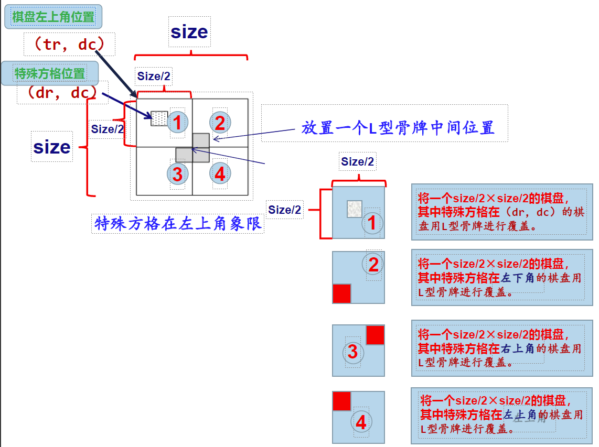​

用$(tr, tc)$表示一个象限左上角方格的坐标，$(dr, dc)$是特殊方格所在的坐标，size是棋盘的行数和列数。
用二维数组board存放覆盖方案，用tile全局变量表示L型骨牌的编号（从整数1开始），board中3个相同的整数表示一个L型骨牌。

‍

```python
def chessboard(b, t, d, s):  # t棋盘左上角，d特殊方格位置，s棋盘大小
   if s == 1:
      return
   global tile  # 初始为1
   tl = tile  # 取一个L型骨，其牌号为tile
   tile += 1
   s //= 2  # 分割棋盘
   if d[0] < t[0]+s and d[1] < t[1]+s:
      chessboard(b, t, d, s)
   else:
      b[t[0]+s-1][t[1]+s-1] = tl
      chessboard(b, t, (t[0]+s-1, t[1]+s-1), s)
   if d[0] < t[0]+s and d[1] >= t[1]+s:
      chessboard(b, (t[0], t[1]+s), d, s)
   else:
      b[t[0]+s-1][t[1]+s] = tl
      chessboard(b, (t[0], t[1]+s), (t[0]+s-1, t[1]+s), s)
   if d[0] >= t[0]+s and d[1] < t[1]+s:
      chessboard(b, (t[0]+s, t[1]), d, s)
   else:
      b[t[0]+s][t[1]+s-1] = tl
      chessboard(b, (t[0]+s, t[1]), (t[0]+s, t[1]+s-1), s)
   if d[0] >= t[0]+s and d[1] >= t[1]+s:
      chessboard(b, (t[0]+s, t[1]+s), d, s)
   else:
      b[t[0]+s][t[1]+s] = tl
      chessboard(b, (t[0]+s, t[1]+s), (t[0]+s, t[1]+s), s)
```

‍

‍

### 大整数乘法

‍

设X和Y都是n（为了简单，假设n为2的幂，且X、Y均为正数）位的二进制整数，现在要计算它们的乘积$X*Y$。采用分治法来设计一个更有效的大整数乘积算法

‍

先将n位的二进制整数X和Y各分为两段，每段的长为n/2位  
由此，$X = A * 2^{n / 2} + B, Y = C * 2^{n / 2} +D$。这样，X和Y的乘积为：$X * Y = (A * 2^{n / 2} + B) * (C * 2^{n / 2} + D) = A * C * 2^n + (A * D + C * B) * 2^{n / 2} + B * D$

如果这样计算$X*Y$，则必须进行4次$n / 2$位整数的乘法$(A * C、A * D、B * C和B * D)$，以及3次不超过n位的整数加法，此外还要做2次移位（分别对应乘2n和乘2n/2）。所有这些加法和移位共用O(n)步运算。

设T(n)是两个n位整数相乘所需的运算总数，则有以下递推式：

$$
\begin{align*}
T(n) &= O(1) &, n = 1 \\
T(n) &= 4T(n / 2) + O(n) &, n \ge 1 \\
\end{align*}
$$

由此可得$(T(n) = O(n^2)$。

采用分治法，把$X*Y$写成另一种形式，虽然该式看起来比前式复杂些，但它仅需做3次n/2位整数的乘法$A * C、B * D和(A - B) * (D - C)$，6次加、减法和2次移位。$T(n) = O(n^{1.59})$

‍

‍

# 动规

‍

    每次决策依赖于当前状态，又随即引起状态的转移，决策系列在变化的状态中逐步产生的，用多阶段最优化决策方式解决问题的过程。

    动态规划是一种解决多阶段决策问题的优化方法，把多阶段过程转化为一系列单阶段问题，利用各阶段之间的关系，逐个求解。通常用递归程序实现，递推关系是实现由分解后的子问题向最终问题求解转化的纽带。

‍

### Tips

‍

某哔站UP云: 动态规划的本质是一个**状态机**,从初始状态开始,进行有向无环的跳转,最后求得最终解

‍

## 原理

‍

### 指导思想

    动态规划是建立在最优原则的基础上，在每一决策步上列出各种可能局部解，按某些条件舍弃肯定不能得到最优解的局部解，这是一个寻找最优判断序列的过程，即不论初始策略如何，下一次决策必须相对前一次决策产生的新状态构成最优序列。这样，在每一步都经过筛选，以每一步的最优性来保证全局的最优性。

‍

### 基本思想

    记录子问题并不断填表。即将待求解的问题分成若干个子问题，先求解子问题，然后从这些子问题的解得到原问题的解。适合动态规划算法求解的问题，经分解后不是互相独立的，即它们可以在多项式时间内被求解出来。

‍

### 要素

能采用动态规划求解的问题的一般要具有3个性质：

‍

#### 最优子结构

问题的最优解包含着其子问题的最优解

‍

#### 无后效性

（马尔可夫性）即某阶段状态一旦确定，就不受这个状态以后决策的影响。也就是说，某状态以后的过程不会影响以前的状态，只与当前状态有关

‍

#### 有重叠子问题

（子问题重叠性）

    递归算法求解问题时，每次产生的子问题并不总是新问题，有些子问题被**反复计算**多次即子问题之间是不独立的，一个子问题在下一阶段决策中可能被多次使用到。（该性质并不是动态规划适用的必要条件，但是如果没有这条性质，动态规划算法同其他算法相比就不具备优势）。

‍

‍

## 区别与联系

‍

### 和分治

    基本思想与分治法类似，也是将待求解的问题分解为若干个子问题（阶段），按顺序求解子阶段，前一子问题的解为后一子问题的求解提供了有用的信息. 在求解任一子问题时，列出各种可能的局部解，通过决策保留那些有可能达到最优的局部解，丢弃其他局部解。依次解决各子问题，最后一个子问题就是初始问题的解。

‍

### 和贪心

‍

    方法和贪心法相似，在动态规划中，可将一个问题的解决方案视为一系列决策的结果。但在贪心法中，每采用一次贪心准则便做出一个不可回溯的决策，还要考察每个最优决策序列中是否包含一个最优子序列。

‍

### 备忘录方法

‍

    备忘录方法是动态规划方法的变形：与动态规划算法不同的是，备忘录方法的递归方式是自顶向下的，而动态规划算法则是自底向上的。

‍

## 性能

‍

影响因素

‍

**问题中需要计算的状态个数**

‍

    状态是描述问题求解过程中的某种情况或属性的变量。状态个数越多，动态规划算法需要处理的情况就越多，时间复杂度也就越高。因此，在设计动态规划算法时，应尽量减少不必要的状态，或者利用一些技巧来压缩状态空间。

‍

**状态转移时涉及的状态数**

‍

    状态转移是指根据上一阶段或相邻阶段的状态来导出本阶段的状态。状态转移时涉及的状态数越多，动态规划算法需要考虑的情况就越多，时间复杂度也就越高。因此，在设计动态规划算法时，应尽量简化状态转移方程，或者利用一些技巧来优化状态转移过程。

‍

**状态转移的时间**

‍

    状态转移的时间是指在已知上一阶段或相邻阶段的状态后，计算本阶段状态所需的时间。状态转移的时间越长，动态规划算法执行一次状态转移所需的时间就越长，时间复杂度也就越高。因此，在设计动态规划算法时，应尽量减少状态转移中涉及的计算量，或者利用一些技巧来加速计算过程。

‍

‍

‍

## 使用

‍

### 大体方针

1. 分析最优解的性质，并刻画其结构特征。
2. 递归的定义最优值。
3. 以自底向上或自顶向下的记忆化方式计算出最优值。
4. 根据计算最优值时得到的信息，构造问题的最优解。

‍

### DP顺推模板

```python
function DP():
    dp = [][]    #二维情况

for i= 0 ..M{
    for j = 0 ..N{
        dp[i]i] =_Function(dp[i']U']..)
    }
}
return dp[M][N];
```

‍

## 实例

‍

### 整数划分

‍

同上

‍

设$f(n, k)$为n的k拆分的拆分方案个数：

1. 当$n = 1, k=1$时，显然$f(n, k) = 1$。
2. 当$n &lt; k$时，有$f(n, k) = f(n, n)$。
3. 当$n = k$时，其拆分方案有将正整数n无序拆分成最大数为n-1的拆分方案，以及将n拆分成1个$n(n = n)$的拆分方案，后者仅仅一种，所以有$f(n, n) = f(n, n-1) + 1$。
4. 当$n &gt; k$时，根据拆分方案中是否包含k，可以分为两种情况：
   1. 拆分中包含k的情况：即一部分为单个k，另外一部分为$\{x_1, x_2, ..., x_i\}$，后者的和为n-k，后者中可能再次出现k，因此是（n-k）的k拆分，所以这种拆分方案个数为$f(n-k, k)$。
   2. 拆分中不包含k的情况：则拆分中所有拆分数都比k小，即n的（k-1）拆分，拆分方案个数为$f(n, k-1)$。
   3. 因此，$f(n, k) = f(n-k, k) + f(n, k-1)$

‍

状态转移方程：

$$
f(n, m) = \left\{\begin{matrix}1 &, n = 1, k = 1 \\
f(n, n) &, n < k \\
f(n, n-1) + 1 &, n = k \\
f(n - k, k) + f(n, k - 1) &, other
\end{matrix}\right.
$$

‍

显然，求$f(n, k)$满足动态规划问题的最优性原理、无后效性和有重叠子问题性质。所以特别适合采用动态规划法求解。设置动态规划数组dp，用$dp[n][k]$存放$f(n, k)$。

‍

```python
def split(n, k):
   dp = [[0 for i in range(k + 1)] for j in range(n + 1)]
   for i in range(1, n + 1):
      for j in range(1, k + 1):
         if i == 1 or j == 1:
            dp[i][j] = 1
         elif i < j:
            dp[i][j] = dp[i][i]
         elif i == j:
            dp[i][j] = dp[i][j - 1] + 1
         else:
            dp[i][j] = dp[i][j - 1] + dp[i - j][j]
   return dp[n][k]
```

‍

由于该问题本身是递归的，可以直接采用递归算法实现：

```python
def fun(n, k):
   if n == 1 or k == 1:
      return 1
   elif n < k:
      return fun(n, n)
   elif n == k:
      return fun(n, n - 1) + 1
   else:
      return fun(n - k, k) + fun(n, k - 1)
```

但由于子问题重叠，存在重复的计算！  
可以设置数组dp，用$dp[n][k]$存放$f(n, k)$，首先初始化dp的所有元素为特殊值0，当$dp[n][k]$不为0时表示对应的子问题已经求解，直接返回结果。

```python
dp = [[0 for i in range(MAXN)] for j in range(MAXN)]
def dpf(n, k):
   if dp[n][k] != 0:
      return dp[n][k]
   if n == 1 or k == 1:
      dp[n][k] = 1
   elif n < k:
      dp[n][k] = dpf(n, n)
   elif n == k:
      dp[n][k] = dpf(n, n - 1) + 1
   else:
      dp[n][k] = dpf(n - k, k) + dpf(n, k - 1)
   return dp[n][k]
```

‍

这种备忘录方法方法是一种递归算法，其执行过程也是自顶向下的，但当某个子问题解求出后，将其结果存放在一张表（dp）中，而且相同的子问题只计算一次，在后面需要时只有简单查表，以避免大量的重复计算

‍

‍

### 最大连续子序列和

同上

‍

【问题求解】对于含有n个整数的序列a，设$b_j = \max\{a_i + a_{i+1} + ... + a_j\}, (1 \le i \le j)(1 \le j \le n)$
表示$a[1..j]$的前j个元素范围内的最大连续子序列和，则$b_{j-1}$表示$a[1..j-1]$的前j-1个元素范围内的最大连续子序列和。

当$b_{j-1} &gt; 0$时，$b_j = b_{j-1} + a_j$，当$b_{j-1} \le 0$时，放弃前面选取的元素，从$a_j$开始重新选起，$b_j = a_j$。用一维动态规划数组dp存放b，对应的状态转移方程如下：$dp[0] = 0, dp[j] = MAX\{dp[j-1] + a_j, a_j\}$

构造问题的解：序列a的最大连续子序列和等于：$dp[j](1 \le j \le n)$中的 即$dp[maxj]$为dp数组中的最大值。在dp数组中，从该位置maxj向前找，找到第一个dp值小于或等于0的元素$dp[k]$，则a序列中从第$k+1~maxj$位置的元素的和构成了该序列的最大连续子序列的和。

‍

‍

```python
def maxSubSum(a):
   dp = [0 for i in range(len(a)+1)]
   for i, v in enumerate(a):
      dp[i+1] = max(dp[i]+v, v)
   max_i = dp.index(max(dp))
   for k in range(max_i, -1, -1):
      if dp[k] <= 0:
         break
   return a[k:max_i]
```

‍

‍

### 最长递增子序列

‍

给定一个无序的整数序列$a[0..n-1]$，求其中最长递增子序列的长度。

‍

‍

设计动态规划数组为一维数组$dp, dp[i]$表示$a[0..i]$中以$a[i]$结尾的最长递增子序列的长度。对应的状态转移方程如下：

$$
\begin{align*}
dp[i] &= 1 &, 0 \le i \le n-1 \\
dp[i] &= max(dp[i], dp[j]+1) &, a[i] > a[j], 0 \le i,j \le n-1
\end{align*}
$$

此处的$dp[j]$是指对于所有的前j+1个元素的最长递增子序列的长度。  
即：当检视$a[i]$时，就看看对于每一个$dp[j]$，在有了$a[i]$后，是否会增加递增子序列的长度。  
求出dp后，其中最大元素即为所求。

‍

【算法描述】

```python
def maxLongIncreasingSubseq(a):
   dp = [1 for _ in range(len(a))]
   for i in range(len(a)):
      for j in range(i):
         if a[i] > a[j]:
            dp[i] = max(dp[i], dp[j] + 1)
   return max(dp)
```

‍

‍

### 最长公共子序列

‍

    字符序列的子序列是指从给定字符序列中随意地（不一定连续）去掉若干个字符（可能一个也不去掉）后所形成的字符序列。给定两个字符序列A和B，如果字符序列Z既是A的子序列，又是B的子序列，则称序列Z是A和B的公共子序列。该问题是求两序列A和B的最长公共子序列（LCS）

‍

‍

‍

若设$X = (x_0, x_1, ..., x_{m-1})$（含m个字符），$Y = (y_0, y_1, ..., y_{n-1})$（含n个字符），设$Z = (z_0, z_1, ..., z_{k-1})$（含k个字符）为它们的最长公共子序列。不难证明有以下性质：

- 如果$x_{m-1} = y_{n-1}$，则$z_{k-1} = x_{m-1} = y_{n-1}，且$(z_0, z_1, ..., z_{k-2})$是$(x_0, x_1, ..., x_{m-2})$和$(y_0, y_1, ..., y_{n-2})$的一个最长公共子序列。
- 如果$x_{m-1} \ne y_{n-1}, z_{k-1} \ne x_{m-1}$，则$(z_0, z_1, ..., z_{k-1})$是$(x_0, x_1, ..., x_{m-2})$和$(y_0, y_1, ..., y_{n-1})$的一个最长公共子序列。
- 如果$x_{m-1} \ne y_{n-1}, z_{k-1} \ne y_{n-1}$，则$(z_0, z_1, ..., z_{k-1})$是$(x_0, x_1, ..., x_{m-1})$和$(y_0, y_1, ..., y_{n-2})$的一个最长公共子序列。

定义二维动态规划数组dp，其中$dp[i][j]$为子序列$(x_0, x_1, ..., x_{i-1})$和$(y_0, y_1, ..., y_{j-1})$的最长公共子序列的长度。每考虑字符$x[i]$或$y[j]$都为动态规划的一个阶段（共经历约$m \times n$个阶段）。

1. 情况1：$x[i-1] = y[j-1]$（当前两个字符相同）$dp[i][j] = dp[i-1][j-1] + 1$
2. 情况2：$x[i-1] \ne y[j-1]$（当前两个字符不同）$dp[i][j] = MAX(dp[i][j-1], dp[i-1][j])$

‍

对应的状态转移方程如下：

$$
\begin{align*}
dp[i][j] &= 0 &,i = 0或j = 0 \\
dp[i][j] &= dp[i-1][j-1] + 1 &,x[i-1] = y[j-1] \\
dp[i][j] &= MAX(dp[i][j-1], dp[i-1][j]) &,x[i-1] \ne y[j-1]
\end{align*}
$$

显然，$dp[m][n]$为最终结果。 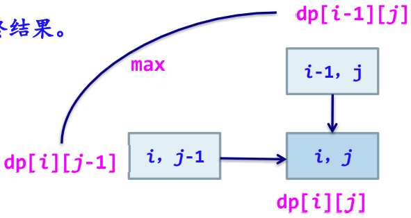

dp -> lcs：$dp[i][j] \ne dp[i][j-1]$（左边）并且$dp[i][j] \ne dp[i-1][j]$（上方）值时：$a[i-1] = b[j-1]$将$a[i-1]$添加到LCS中。

- $dp[i][j] = dp[i][j-1]$：与左边相等 -> j--
- $dp[i][j] = dp[i-1][j]$：与上方相等 -> i--
- 与左边、上方都不相等：$a[i-1]$或者$b[j-1]$属于LCS -> i--, j--

‍

‍

```python
def lcs(x, y):
   m = len(x)
   n = len(y)
   dp = [[0 for i in range(n+1)] for j in range(m+1)]
   for i in range(1, m+1):
      for j in range(1, n+1):
         if x[i-1] == y[j-1]:
            dp[i][j] = dp[i-1][j-1] + 1
         else:
            dp[i][j] = max(dp[i-1][j], dp[i][j-1])
   k = dp[m][n]
   i = m
   j = n
   res = ''
   while k > 0:
      if dp[i][j] == dp[i-1][j]:
         i -= 1
      elif dp[i][j] == dp[i][j-1]:
         j -= 1
      else:
         res += x[i-1]
         k -= 1
         i -= 1
         j -= 1
   return res[::-1]
```

【算法分析】 LCSlength算法中使用了两重循环，所以对于长度分别为m和n的序列，求其最长公共子序列的时间复杂度为$O(m \times n)$。空间复杂度为$O(m \times n)$。

‍

‍

### 0/1背包

‍

问题划分阶段：将整体问题划分成若干个阶段（阶段一定是有序的）

* 设置一个解向量$X(x_1, x_2, ..., x_n)$
* 含义：n个物品，每一个对应一个$x_i$，

  * $x_i = 0$代表对应的物品i不放入背包，
  * $x_i = 1$代表对应的物品i放入背包
* 假设按$i = 1, 2, ..., n$来确定$x_i$的值，对应n次决策即n个阶段的次序。
* 例如：若背包当前容量为r，（前提背包当前容量$r \ge w_i$）

  * 若$x_1 = 0$ -> 问题转化为其余物品$(x_2, ..., x_n)$，背包容量为r的问题，此时解向量为$(0, x_2, ..., x_n)$，当前背包容量为r
  * 若$x_1 = 1$ -> 问题转化为其余物品$(x_2, ..., x_n)$，背包容量为$r - w_1$的问题，此时解向量为$(1, x_2, ..., x_n)$，当前背包剩余容量为$r - w_1$
* 决策第i个物品的情况，当前背包剩余容量为r

  * 若（即第i个物品的重量）$w_i > r$，则不装入第i个物品。即$X(x_1, x_2, ..., x_{i-1}, 0, x_{i+1}, ..., x_n)$
  * 若（即第i个物品的重量）$w_i \le r$，则

    * 装入第i个物品，问题转换为：$X(x_1, x_2, ..., x_{i-1}, 0, x_{i+1}, ..., x_n)$，当前背包容量为r
    * 装入第i个物品，问题转换为：$X(x_1, x_2, ..., x_{i-1}, 1, x_{i+1}, ..., x_n)$，当前背包剩余容量为$r - w_i$

‍

状态描述及状态变量：

* 设置二维动态规划数组dp，$dp[i][r]$表示当前背包（剩余）容量为$r ,(1 \le r \le W)$，
* 此时已装入了（1~i-1中的某些物品后），现在考虑第i个物品的决策后，背包装入物品的最优价值。
* ​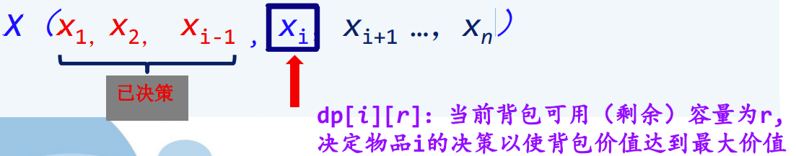​

‍

确定状态转移公式（方程）：

* 设置二维动态规划数组dp，即由第i-1个物品决策后形成的第i-1个状态（阶段）如何决策第i个状态（阶段）
* $dp[i][r]$表示当前背包（剩余）容量为$r ,(1 \le r \le W)$，
* 此时已装入了（1~i-1中的某些物品后），现在考虑第i个物品的决策后，背包装入物品的最优价值。

状态转移方程如下：

- 【边界条件】
  - $dp[i][0] = 0 ,(1 \le i \le n)$（背包不能装入任何物品，总价值为0）
  - $dp[0][r] = 0 ,(1 \le r \le W)$（没有任何物品可装入，总价值为0）
- 若$r &lt; w_i$即当前背包剩余容量r<物品i的重量时：$dp[i][r] = dp[i-1][r]$（当$r &lt; w[i]$时，物品i放不下对应的$x_i = 0$）
- 若$r \ge w_i$即当前背包剩余容量r>=物品i的重量时：对于物品i的决策有两种情况：
  - 物品i不被装入则$dp[i][r] = dp[i-1][r]$
  - 物品i被装入则$dp[i][r] = dp[i-1][r-w[i]] + v[i]$
- $dp[i][r] = MAX{dp[i-1][r], dp[i-1][r-w[i]] + v[i]}$
- 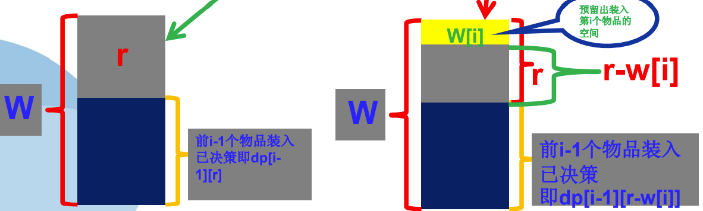

‍

由dp数组推导解向量x：从$dp[n][W]$开始

- 若$dp[i][r] \ne dp[i-1][r]$，若$dp[i][r] = dp[i-1][r-w[i]] + v[i]$，置$x[i] = 1$，累计总价值$maxv += v[i]$，递减剩余重量$r = r - w[i]$。
- 若$dp[i][r] = dp[i-1][r]$，表示物品i放不下或者不放入物品i，置$x[i]=0$。

‍

‍

```python
def Knap(wv, W):
   wv = [[0, 0]] + wv
   dp = [[0 for i in range(W+1)] for j in range(len(wv))]
   for i in range(0, len(wv)):
      for r in range(1, W+1):
         if r < wv[i][0]:
            dp[i][r] = dp[i-1][r]
         else:
            dp[i][r] = max(dp[i-1][r], dp[i-1][r-wv[i][0]] + wv[i][1])
   x = []
   i = len(wv)-1
   while i >= 0:
      if dp[i][W] != dp[i-1][W]:
         x.append(i)
         W -= wv[i][0]
      i -= 1
   return x[::-1], sum(wv[i][1] for i in x)
```

‍

【算法分析】Knap()算法中含有两重for循环，所以时间复杂度为$O(n \times W)$，空间复杂度为$O(n \times W)$

‍

‍

‍

# 贪心

‍

    贪心法的基本思路是在对问题求解时总是做出在当前看来^（反映“贪婪性”）^是最好的选择，也就是说贪心法不从整体最优上加以考虑，所做出的仅是在某种意义上的局部最优解。

‍

‍

### Tips

‍

    在很多情况下，所有局部最优解合起来不一定构成整体问题的最优解，所以贪心法不能保证对所有问题都得到整体最有解, 除非证明该算法的每一步做出的选择都**必然**最终导致问题的整体最优

‍

做出贪心决策的依据称为贪心准则(策略)

‍

‍

‍

## 原理

‍

### 贪心选择性质

‍

    所求问题的整体最优解可以通过一系列局部最优的选择，即贪心选择来达到

‍

    也就是说，贪心法仅在当前状态下做出最好选择，即局部最优选择，然后再去求解做出这个选择后产生的相应子问题的解。

‍

证明方法：数学归纳法

    先考虑问题的一个整体最优解，并证明可以修改这个最优解，使其从贪心选择开始，在做出贪心选择后，原问题可以转化为规模较小的类似问题，通过每一步的贪心选择，最后得到问题的整体最优解。

‍

### 最优子结构性质

‍

    如果一个问题的最优解包含其子问题的最优解，则称此问题具有最优子结构性质。

    问题的最优子结构性质是该问题可用动态规划算法或贪心法求解的关键特征。

‍

证明方法：反证法

1. 首先：假设由这个问题的最优解X导出的子问题的解X’不是最优的。
2. 然后：证明在这个假设下可以构造出比原问题的最优解X更优的解Y，从而引出矛盾。
3. 得证: 问题具有最优子结构性质。

‍

‍

## 区别与联系

‍

‍

### 和动态规划

‍

|项目|基本思想|依赖子问题的解|解问题的方向|最优解|复杂程度|
| ----------| --------------| ----------------| --------------| ----------| ----------|
|贪心选择|贪心选择|否|自顶向下|局部最优|简单有效|
|动态规划|递归定义填表|是|自底向上|整体最优|较复杂|

‍

## 性能

‍

各异

一般来看大部分贪心算法设计的很简单, 很符合直观的"笨"思路, 但是执行起来的效果不会比正统写法差多少, 并且性能也很好

‍

具体的性能分析类似动态规划, 减少状态转移的损耗, 尽量设计良好的转移方法都能优化性能

‍

‍

‍

## 使用

‍

### 适合问题

‍

贪心算法通常用来解决具有最大值或最小值的优化问题。

它是从某一个初始状态出发，根据当前局部而非全局的最优决策，以满足约束方程为条件，以使得目标函数的值增加最快或最慢为准则，选择一个最快地达到要求的输入元素，以便尽快地构成问题的可行解。

‍

### 大体方针

‍

1. 选定合适的贪心选择的标准；
2. 证明在此标准下该问题具有 贪心选择性质 + 最优子结构性质
3. 根据贪心选择的标准，写出贪心选择的算法，求得最优解。

    ‍

    算法框架（设解向量$(x_0, x_1, ..., x_{n-1})$类型为SolutionType，其分量为SType类型）

    ```c++
    SolutionType Greedy(SType C[]) { // C:候选集合（问题的输入集合）
       SolutionType S = {}; // 解集合（初始为空集）
       while (not solution(S)) { //集合S没有构成问题的一个解
          x = select(C); // 在候选集合C中做贪心选择
          if feasiable(S, x) // 判断集合S中加入x后的解是否可行
             S = S + {X};
          C = C - {x};
       }
       return S;
    }
    ```

‍

### 具体贪心流程

‍

    从问题的某一个初始解{}出发，采用逐步构造最优解的方法向给定的目标前进，每一步决策产生n-元组解$(x_0, x_1, ..., x_{n-1})$的一个分量。每一步上用作决策依据的选择准则被称为**最优量度标准**（或贪心准则），也就是说，在选择解分量的过程中，添加新的解分量$x_k$后，形成的部分解$x_0, x_1, ..., x_k$不违反可行解约束条件。每一次贪心选择都将所求问题简化为规模更小的子问题，并期望通过每次所做的局部最优选择产生出一个全局最优解。

‍

## 实例

‍

### 单源最短路径

【问题描述】给定一个带权有向图$G = (V, E)$，其中每条边的权是非负实数，另外，给定V中的一个顶点作为源点。现在要计算源点到其他各顶点的最短路径长度。这里路径长度是指路上各边权之和。

‍

迪杰斯特拉^（Dijkstra）^算法是一种按路径长度递增序产生各顶点最短路径的贪心算法。

‍

算法步骤：

1. 初始时，S中仅含有源。设u是V的某一个顶点，把从源到u且中间只经过S中顶点的路称为从源到u的特殊路径，并用数组distance记录当前每个顶点所对应的最短特殊路径长度。
2. 每次从集合V-S中选取到源点v0路径长度最短的顶点w加入集合S。S中每加入一个新顶点w，都要修改顶点v0到集合V-S中节点的最短路径长度值。集合V-S中各节点新的最短路径长度值为原来最短路径长度值与顶点w的最短路径长度加上w到该顶点的路径长度值中的较小值。
3. 直到S包含了所有V中顶点，此时，distance就记录了从源到所有其他顶点之间的最短路径长度。

‍

【贪心策略】设置两个顶点集合S和V-S，集合S中存放己经找到最短路径的顶点，集合V-S中存放当前还未找到最短路径的顶点。设置顶点集合S，并不断地作贪心选择来扩充这个集合。一个顶点属于集合S当且仅当从源到该顶点的最短路径长度已知。

‍

贪心选择性质

* Dijkstra算法所作的贪心选择是从V-S中选择具有最短路径的顶点u，从而确定从源到u的最短路径长度$distance[u]$。
* 如果存在一条从源到u且长度比$distance[u]$更短的路，设这条路初次走出S之外到达的顶点为$x \in V - S$，如图：​
* 在这条路径上，分别记cost(v, x), cost(x, u)和cost(v, u)为顶点v到顶点x，顶点x到顶点v到顶点u的路长，那么$distance[x] \le cost(v, x), cost(v, x) + cost(x, u) = cost(v, u) < distance[u]$。
* 利用边权的非负性，可知$cost(x, u) \ge 0$，从而推出$distance[x] < distance[u]$。此为矛盾。这就证明了$distance[u]$是从源到顶点u的最短路径长度。

‍

最优子结构性质

* 算法中确定的$distance[u]$确实是源点到顶点u的最短特殊路径长度。为此，只要考察算法在添加u到S中后，$distance[u]$的值所引起的变化。当添加u之后，可能出现一条到顶点i特殊的新路。
* 情况一：从u直接到达i。如果$cost[u][i] + distance[u] < distance[i]$，则$cost[u][i] + distance[u]$作为$distance[i]$新值。
* 情况二：从u不直接到达i，而是回到老S中某个顶点x，最后到达i。当前$distance[i]$的值小于从源点经u和x，最后到达i的路径长度。因此，算法中不考虑此路。由此，不论$distance[u]$的值是否有变化，它总是关于当前顶点集S到顶点u的最短特殊路径长度。

‍

‍

```python
def dijkstra(g, b):
   """
   Dijkstra's algorithm for finding the shortest path from a source to all
   other vertices in a graph. (by Copilot)

   Parameters
   ----------
   g : graph
      The graph to find the shortest path in.
   b : vertex
      The source vertex.

   Returns
   -------
   d : dictionary
      The dictionary of shortest paths.
   p : dictionary
      The dictionary of predecessors.
   """
   d = {}
   p = {}
   for v in g.vertices:
      d[v] = float('inf')
      p[v] = None
   d[b] = 0
   Q = g.vertices.copy()
   while Q:
      u = min(Q, key=lambda v: d[v])
      Q.remove(u)
      for v in g.neighbors(u):
         alt = d[u] + g.distance(u, v)
         if alt < d[v]:
            d[v] = alt
            p[v] = u
   return d, p
```

‍

‍

### 背包

‍

有一个背包可以携带的最大重量不超过W。在不超过背包负重的前提下，使背包装入的总价值最大（即效益最大化），与0/1背包问题的区别是，这里的每个物品可以取一部分装入背包。

‍

【问题求解】设$x_i$表示物品i装入背包的情况，$0 \le x_i \le 1$。

根据问题的要求，有

- 约束条件：$\sum_{i=1}^{n} w_i x_i \le W, (0 \le x_i \le 1, (1 \le i \le n))$
- 目标函数：$\max{\sum_{i=1}^{n} v_i x_i}$

‍

问题转化为：寻找一个满足上述约束条件，并使目标函数达到最大的解向量$X = \{x_1, x_2, ..., x_n\}$。

‍

1. “效益”优先，使每装入一件物品就使背包获得最大可能的效益值增量。按物品收益从大到小排序...

    ‍

    * 非最优解。原因：只考虑当前收益最大,而背包可用容量消耗过快
2. 选重量作为量度，使背包容量尽可能慢地被消耗。按物品重量从小到大排序...

    ‍

    * 最优解。原因：虽然容量消耗慢，但效益没有很快的增加
3. 选==利润/重量==为量度，使每一次装入的物品应使它占用的每一单位容量获得当前最大的单位效益。按物品的$v_i / w_i$从大到小排序

    ‍

    * 最优解

‍

【贪心策略】

选择单位重量价值最大的物品。

背包问题具有最优子结构性质

‍

1. 贪心选择物体1之后，问题转化为背包重量为$m - w_1 * x_1$，物体集为$\{物体_2, 物体_3, ..., 物体_n\}$的背包问题。且该问题的最优解包含在初始问题的最优解中。
2. 对于部分背包和0-1背包这两类问题都具有最优子结构性质。对于部分背包问题，类似地，若它的一个最优解包含物品j，则从该最优解中拿出所含的物品j的那部分重量w，剩余的将是n-1个原重物品1, 2, ..., j-1, j+1, ..., n及重为$w_j - w$的物品j中可装入容量为c-w的背包且具有最大价值的物品。

‍

```python
def Knap(w, a):  # w限重，a待放入的物品(重量, 价值)
   x = []
   a.sort(key=lambda x: x[1]/x[0], reverse=True)
   for ow, ov in a:
      x.append(1 if ow <= w else w/ow)
      w -= x[-1]*ow
      if w <= 0:
            break
   total = sum([i*j*k for i, (j, k) in zip(x, a)])
   return total, w  # 总价值，剩余重量
```

‍

【算法分析】

对$v_i / w_i$排序的时间复杂性为$O(nlog_2n)$，while循环的时间为O(n)，所以本算法的时间复杂度为$O(nlog_2n)$。

‍

‍

### 简单最多装载

‍

有n个集装箱要装上一艘载重量为W的轮船，其中集装箱i ($1 \le i \le n$) 的重量为$w_i$

选出尽可能**多**的集装箱装上轮船，使它们的重量之和不超过W

‍

解

1. 当重量限制为W时，$w_i$越小可装载的集装箱个数越多，所以采用优先选取重量轻的集装箱装船的贪心思路。
2. 对$w_i$从小到大排序得到$\{w_1, w_2, ..., w_n\}$，设最优解向量为$x = \{x_1, x_2, ..., x_n\}$，显然，$x_1 = 1$，则$x' = \{x_2, ..., x_n\}$是装载问题$w' = \{w_2, ..., w_n\}$，$W' = W - w_1$的最优解(最小嘛)，满足贪心最优子结构性质。

‍

```python
def loadway(ws, mw):  # ws：重量集合，mw：最大重量
   ws.sort()
   for i in range(len(ws)):
      if sum(ws[:i+1]) > mw:
         return ws[:i], sum(ws[:i]), mw-sum(ws[:i])
```

算法的主要时间花费在排序上，时间复杂度为$O(nlog_2n)$。

‍

‍

### 活动安排

‍

假设有一个需要使用某一资源的n个活动所组成的集合$S, S = \{1, ..., n\}$。

- 该资源任何时刻只能被一个活动所占用，活动i有一个开始时间$b_i$和结束时间$e_i$，$(b_i &lt; e_i)$，其执行时间为$e_i - b_i$，假设最早活动执行时间为0。
  - 一旦某个活动开始执行，中间不能被打断，直到其执行完毕。
  - 若活动i和活动j有$b_i \ge e_j$或$b_j \ge e_i$，则称这两个活动兼容。
- 设计算法求一种最优活动安排方案，使得所有安排的活动个数最多。

‍

【问题求解】假设活动时间的参考原点为0。一个活动$i, (1 \le i \le n)$用一个区间$[b_i, e_i)$表示，当活动按结束时间（右端点）递增排序后，两个活动$[b_i, e_i)$和$[b_j, e_j)$兼容（满足$b_i \ge e_j$或$b_j \ge e_i$，实际上就是指它们不相交。
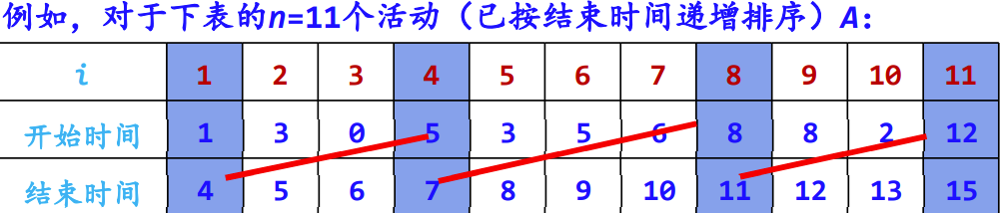

‍

```python
def action(a):
   a.sort(key=lambda x: x[1])
   res = []
   p = 0
   for b, e in a:
      if b > p:
         res.append((b, e))
         p = e
   return res
```

‍

【算法证明】通常证明一个贪心选择得出的解是最优解的一般的方法是，构造一个初始最优解，然后对该解进行修正，使其第一步为一个贪心选择，证明总是存在一个以贪心选择开始的求解方案。对于本问题，所有活动按结束时间递增排序，就是要证明：若X是活动安排问题A的最优解，$X = X' \cup \{1\}$，则X'是$A' = \{i \in A: e_i \ge b_1\}$的活动安排问题的最优解。

‍

贪心选择性质

* 首先证明总存在一个以活动1开始的最优解。
* 如果第一个选中的活动为$k (k \ne 1)$，可以构造另一个最优解Y，Y中的活动是兼容的，Y与X的活动数相同。
* 那么用活动1取代活动k得到Y'，因为$e_1 \le e_k$，所以Y'中的活动是兼容的，即Y'也是最优的，这就说明总存在一个以活动1(即活动结束时间最小的活动)开始的最优解。

‍

最优子结构性质

* 当做出了对活动1的贪心选择后，原问题就变成了在活动2、...、n中找与活动1兼容的那些活动的子问题。
* 亦即，如果X为原问题的一个最优解，则$X' = X - \{1\}$也是活动选择问题$A' = \{i \in A | b_i \ge e_1\}$的一个最优解。
* 反证法：如果能找到一个A'的含有比X'更多活动的解Y'，则将活动1加入Y'后就得到A的一个包含比X更多活动的解Y，这就与X是最优解的假设相矛盾。
* 因此，在每一次贪心选择后，留下的是一个与原问题具有相同形式的最优化问题，即最优子结构性质。

‍

‍

# 回溯

‍

使用回溯法进行状态空间树裁剪分支时一般有两个标准：约束条件和目标函数的界，N皇后问题和0/1背包问题正好是两种不同的类型，其中同时使用**约束条件**和**目标函数**的界进行裁剪的是 **0/1背包问题** ，只使用约束条件进行裁剪的是 **N皇后问题**。

‍

‍

在算法设计中，有很多问题是无法运用某种公式推导或采用循环的方法来求解的。

假如完成某一件事需要经过若干步骤，而每一步又都有若干种可能的方案供选择，完成这件事就有许多方法。当需要在其中找出满足条件的最优解时，无法根据某些确定的计算法则，而是利用试探和回溯的搜索策略。

回溯法是一种优选搜索方法，按照设定的条件向前搜索。如果走到某一步时发现当前的选择并不优或无解，则回退一步（回溯），重新进行选择，直到达到目标或结束。搜索过程既系统又带有跳跃性。

‍

### Tips

回溯和分枝限界法是比较常用的对候选解进行系统检查的方法, 能够用来求解规模很大的问题

回溯法有“通用解题法”之称。

回溯法求解问题类型：找所有解、找最优解

‍

## 原理

‍

    回溯法按照选优条件进行深度优先搜索以达到目标, 本质是先序遍历一棵状态树过程，不是遍历前预先建立，而是隐含在遍历过程中，使用它可以避免穷举式搜索，适用于解一些排列和组合数相当大的问题. “能进则进，进不了则换，换不了则退”

‍

### 三要素

* 解空间
* 约束条件
* 状态树

‍

### 概念

‍

#### 结点

* 扩展结点（E-结点,Expansion Node）  
  一个正在产生儿子的结点称为扩展结点
* 活结点（L-结点,Live Node）  
  一个自身已生成但其儿子还没有全部生成的节点称做活结点
* 死结点（D-结点,Dead Node）  
  一个所有儿子已经产生的结点称做死结点

‍

‍

#### 解向量

‍

    $(x_1, x_2, ..., x_n)$  

    对于问题的一个实例，解向量满足**显式约束条件**的所有多元组，**至少**包含问题的一个（最优）解同一问题可有**多种表示**

‍

‍

#### 解空间

‍

    问题的解由解向量$(x_1, x_2, ..., x_n)$组成，其中分量$x_i$表示第i步的操作. 对于问题的一个示例，所有满足显式约束条件的多元解向量组构成了该实例的一个解空间

    问题的解空间一般用树形式来组织，也称为解空间树或状态空间，分为子集树和排列树. 树中的每一个结点确定所求解问题的一个问题状态。树的根结点位于第1层，表示搜索的初始状态，第2层的结点表示对解向量的第一个分量做出选择后到达的状态，以此类推。

‍

##### 子集树

‍

    问题是从n元素集合中找出满足某种性质的==子集==时，相应的解空间树称为子集树。

   通常有2n个叶结点，结点总数为2n+1-1。需Ω(2n)计算时间。

‍

    如n个物品的0-1背包问题的解空间是一棵子集树。

‍

##### 排列树

‍

    问题是从n元素集合中找出满足某种性质的==排列==时，相应的解空间树称为排列树

    排列树通常有n!个叶结点。因此遍历排列树需要Ω(n!)计算时间。

‍

    TSP(旅行售货员问题)的解空间是一棵排列树。

‍

‍

#### 解类型

‍

问题的可行解：解空间中满足约束条件的解（决策序列）

问题的最优解：在约束条件下目标达到最优的可行解

‍

#### 约束类型

‍

显约束：对每个分量$x_i$的取值限定

隐约束：对不同分量之间施加的约束

‍

#### 剪枝函数

‍

    用**约束函数**在扩展结点处剪去不满足约束的子树；  
    用**限界函数**剪去得不到最优解的子树。

在选择约束函数时通常存在**生成结点数**与约束函数**计算量**之间的折中

‍

### 搜素解空间

‍

    要点: 具有限界函数的深度优先的问题状态生成法

‍

    先定义问题的解空间(问题求解的空间)，然后在问题的解空间树中，按深度优先策略，从根结点出发搜索解空间树。

    算法搜索至解空间树的任一结点时，总是先判断该结点是否肯定包含问题的解。如果肯定不包含，则跳过对以该结点为根的子树的搜索，逐层向其祖先结点回溯；否则，进入该子树，继续按深度优先的策略进行搜索。

‍

## 区别与联系

‍

### 与深度优先遍历

‍

【相同点】

    回溯法在实现上也是遵循深度优先的，即一步一步往前探索，而不像广度优先遍历那样，由近及远地搜索

‍

【不同点】

1. 访问序不同：深度优先遍历目的是“遍历”，本质是无序的。而回溯法目的是“求解过程”，本质是有序（按序搜索）的。
2. 访问次数的不同：深度优先遍历对已经访问过的顶点不再访问，所有顶点仅访问一次。而回溯法中已经访问过的顶点可能再次访问。
3. 剪枝的不同：深度优先遍历不含剪枝，而很多回溯算法采用剪枝条件剪除不必要的分枝以提高效能。

‍

‍

## 性能

‍

### 时间

‍

通常以回溯算法的解空间树中的结点数作为算法的时间分析依据，假设解空间树共有n层。

* 第1层有$m_0$个满足约束条件的结点，每个结点有$m_1$个满足约束条件的结点；
* 第2层有$m_0 m_1$个满足约束条件的结点，同理，第3层有$m_0 m_1 m_2$个满足约束条件的结点。
* 第n层有$m_0 m_1 ... m_{n-1}$个满足约束条件的结点，则采用回溯法求所有解的算法的执行时间为：$T(n) = m_0 + m_0 m_1 + m_0 m_1 m_2 + ... + m_0 m_1 m_2 ... m_{n-1}$。

‍

通常情况下，回溯法的效率会高于蛮力法（通过剪枝函数减少不必要的搜索）

* 解空间为子集树：算法时间复杂度为：$O(2^n)$
* 解空间为排列树：算法时间复杂度为：$O(n!)$

‍

### 空间

‍

在任何时刻，算法只保存从根结点到当前扩展结点的路径。如果解空间树中从根结点到叶结点的最长路径的长度为h(n)，则回溯法所需的计算空间通常为O(h(n))

‍

显式地存储整个解空间则需要O(2h(n）)或O(h(n)!)内存空间

‍

### 影响因素

‍

1. 产生x[k]的时间；
2. 满足显约束的x[k]值的个数；
3. 计算约束函数constraint的时间；
4. 计算限界函数bound的时间；
5. 满足约束函数和上界函数的所有x[k]的个数。

‍

## 使用

‍

### 大体方针

‍

1. 针对所给问题，定义问题的解空间, 确定解空间树类型（子集树or排列树），问题的解空间树应至少包含问题的一个（最优）解。
2. 确定结点的扩展规则
3. 以深度优先方式搜索解空间，并在搜索过程中用剪枝函数避免无效搜索。

‍

‍

### 回溯流程

‍

1. 确定解空间的组织结构后（子集树or排列树），回溯法就从开始结点(根结点)出发，以深度优先搜索的方式搜索整个解空间。
2. 这个开始结点就成为一个活结点，同时也成为当前的扩展结点。
3. 在当前的扩展结点处，搜索向纵深方向移至一个新结点。这个新结点就成为一个新的活结点，并成为当前扩展结点。
4. 如果在当前的扩展结点处不能再向纵深方向移动，则当前的扩展结点就成为死结点。
5. 此时，应往回移动(回溯)至最近的一个活结点处，并使这个活结点成为当前的扩展结点。
6. 回溯法即以这种工作方式递归地在解空间中搜索，直至找到所要求的解或解空间中已无活结点时为止。

‍

‍

#### 递归回溯

采用递归的方法对解空间树进行深度优先遍历来实现回溯

‍

* 解空间为子集树

  ```c++
  int x[n];             // x存放解向量，全局变量
  void backtrack(int i) //求解子集树的递归框架
  {
     if (i > n) //搜索到叶子结点,输出一个可行解
        输出结果;
     else
     {
        for (j = 下界; j <= 上界; j++) //用j枚举i所有可能的路径
        {
           x[i] = j; //产生一个可能的解分量
           ...       //其他操作
           if (constraint(i) && bound(i))
              backtrack(i + 1); //满足约束条件和限界函数,继续下一层
        }
     }
  }
  ```
* 解空间为排列树

  ```c++
  int x[n];             // x存放解向量，并初始化
  void backtrack(int i) //求解排列树的递归框架
  {
     if (i > n) //搜索到叶子结点,输出一个可行解
        输出结果;
     else
     {
        for (j = i; j <= n; j++) //用j枚举i所有可能的路径
        {
           ...                     //第i层的结点选择x[j]的操作
           swap(x[i], x[j]); //为保证排列中每个元素不同,通过交换来实现
           if (constraint(i) && bound(i))
              backtrack(i + 1); //满足约束条件和限界函数，进入下一层
           swap(x[i], x[j]);     //回溯（退层）恢复状态
           ...                     //第i层的结点选择x[j]的恢复操作
        }
     }
  }
  ```

‍

#### 迭代回溯

采用非递归迭代过程对解空间树进行深度优先遍历来实现回溯

```c++
int x[n]; // x存放解向量，全局变量
void backtrack(int n)
{ //非递归框架
   int i = 1; //根结点层次为1
   while (i >= 1)
   { //尚未回溯到头
      if (ExistSubNode(t))
      { //当前结点存在子结点
         for (j = 下界; j <= 上界; j++)
         { //对于子集树，j=0到1循环
            x[i] 取一个可能的值;
            if (constraint(i) && bound(i))
            { // x[i]满足约束条件或界限函数
               if (x是一个可行解)
                  输出x;
               else
                  i++; //进入下一层次搜索
            }
         }
      }
      else
         i--; //回溯：不存在子结点，返回上一层
   }
}
```

‍

‍

## 实例

‍

### 01背包

‍

**背包问题可以用贪心算法求解，而0-1背包问题不行**

‍

0-1背包问题: 在装入背包时，每种物品i只有两种选择，装入或者不装入，既不能装入多次，也不能只装入一部分;

    如果在装入背包时，物品可以切割，即可以只装入一部分，这种情况下的问题称为背包问题。

‍

#### 总重为W

‍

用$w[1..n]/v[1..n]$存放物品信息，$x[1..n]$数组存放最优解，其中每个元素取1或0，$x[i] = 1$表示第i个物品放入背包中，$x[i] = 0$表示第i个物品不放入背包中。  
这是一个求最优解问题。找到更优解$(op, tv) -> (x, maxv)$

‍

【问题解空间】

‍

解空间是一棵子集树  
对第i层上的某个分枝结点，对应的状态为$dfs(i, tw, tv, op)$，其中tw表示装入背包中的物品总重量，tv表示背包中物品总价值，op记录一个解向量。该状态的两种扩展如下：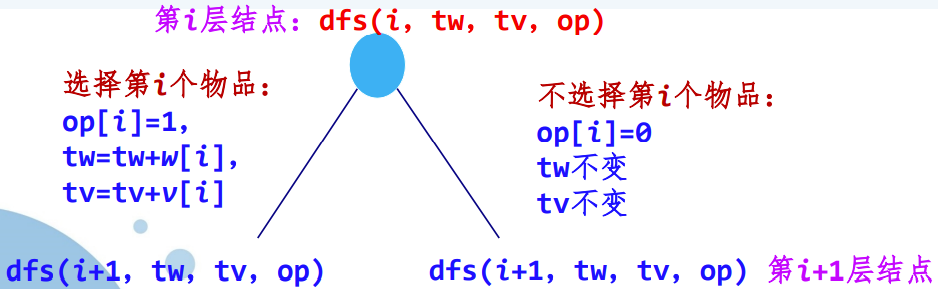​

* 叶子结点表示已经对n个物品做了决策。
* 对所有叶子结点进行比较求出满足$tw = W$的最大maxv，对应的最优解op存放到x中。

‍

‍

```python
def bag(wv, W):
   n_maxv = [len(wv), 0]
   x = [-1]*n_maxv[0]

   def dfs(i, tw, tv, op):
      if i >= n_maxv[0]:
         if tw == W and tv > n_maxv[1]:
            n_maxv[1] = tv
            x[:] = op[:]
         return
      op[i] = 1
      dfs(i+1, tw+wv[i][0], tv+wv[i][1], op)
      op[i] = 0
      dfs(i+1, tw, tv, op)
   dfs(0, 0, 0, [-1]*n_maxv[0])
   return n_maxv[1], [_ for _ in range(n_maxv[0]) if x[_] == 1]
```

‍

【算法改进（增加剪枝函数）】

* 【改进1：左剪枝】：对于第i层的有些结点，$tw + w[i]$已超过了W，显然再选择$w[i]$是不合适的 -> 仅仅扩展满足$tw + w[i] \le W$的左孩子结点
* 【改进2：右剪枝】：$rw = w[i] + w[i+1] + ... + w[n]$。当不选择物品i（第i个物品的决策已做出即不选择）时：$rw - w[i] = w[i+1] + ... +w[n]$，若$tw + rw - w[i] < W$，也就是说即使选择后面的所有物品，重量也不会达到W，因此不必要再考虑扩展这样的结点。 -> 仅仅扩展满足$tw + rw - w[i] \ge W$的右孩子结点

‍

改进算法

```python
def bag(wv, W):
   n_maxv = [len(wv), 0]
   x = [-1]*n_maxv[0]

   def dfs(i, tw, tv, op):
      if i >= n_maxv[0]:
         if tw == W and tv > n_maxv[1]:
            n_maxv[1] = tv
            x[:] = op[:]
         return
      if tw + wv[i][0] <= W:
         op[i] = 1
         dfs(i+1, tw+wv[i][0], tv+wv[i][1], op)
      if tw + sum([wv[_][0] for _ in range(i+1, n_maxv[0])]) >= W:
         op[i] = 0
         dfs(i+1, tw, tv, op)
   dfs(0, 0, 0, [-1]*n_maxv[0])
   return n_maxv[1], [_ for _ in range(n_maxv[0]) if x[_] == 1]
```

【算法分析——改进后】

    该算法不考虑剪枝时解空间树中有$2^{n+1} - 1$个结点（剪枝的结点个数不确定），所以最坏情况下算法的时间复杂度为O($2^n$)

‍

要求背包装满且价值最大的0-1背包问题

‍

要求背包装满（是前面的子集和问题，在这里是0-1背包的约束条件）, 在满足子集和（物品的重量之和为W）的约束下，寻求所选的物品的价值最大的子集和（物品集合）才是这个0-1背包问题的最优解。

‍

#### 总重不超W

‍

问题变为求背包中物品重量和不超过W的最大价值的装入方案：

1. 左剪枝方式不变：仅仅扩展$tw + w[i] \le W$的左孩子结点
2. 右剪枝方式改为采用上界函数进行右剪枝：仅仅扩展$bound(i, tw, tv) > maxv$的右孩子结点

    * 基于子集和（选择放进背包的物品重量和为W）的右剪枝 -> 基于最大价值的的右剪枝

‍

* 上界函数$bound(i) = tv + r$：表示沿着该方向选择得到物品的价值上界
* r表示剩余物品的总价值
* 假设当前求出最大价值maxv，若$bound(i) \le maxv$，则右剪枝，否则继续扩展。
* 显然r越小，bound(i)也越小，剪枝越多，为了构造更小的r，将所有物品以单位重量价值递减排列。
* 当第i个物品不选的时候，计算一个背包物品价值的上界值（即剩余的第i+1个物品到第n个物品“都选”所能达到的物品价值的上界。）所谓的“都选”还要受到所选物品的重量之和不能超过W。

‍

```python
def bag(wv, W):
   n_maxv = [len(wv), 0]
   x = [-1]*n_maxv[0]

   def bound(i, tw, tv):
      i += 1
      while i < n_maxv[0] and tw + wv[i][0] <= W:
         tw += wv[i][0]
         tv += wv[i][1]
         i += 1
      return tv + (W - tw) * (wv[i][1]/wv[i][0]) if i < n_maxv[0] else tv

   def dfs(i, tw, tv, op):
      if i >= n_maxv[0]:
         if tw == W and tv > n_maxv[1]:
            n_maxv[1] = tv
            x[:] = op[:]
         return
      if tw + wv[i][0] <= W:
         op[i] = 1
         dfs(i+1, tw+wv[i][0], tv+wv[i][1], op)
      if bound(i, tw, tv) > n_maxv[1]:
         op[i] = 0
         dfs(i+1, tw, tv, op)
   dfs(0, 0, 0, [-1]*n_maxv[0])
   return n_maxv[1], [_ for _ in range(n_maxv[0]) if x[_] == 1]
```

‍

### N皇后

‍

用一棵树表示问题的解空间。假设皇后i放在第i行上，问题可以表示成n元组$(x_1, x_2, ..., x_n)$，其中$x_i (i = 1, 2, ..., n)$表示皇后i所放位置的列号，此时该问题的解空间为$n^n$个n元组

加上隐式约束条件：没有两个$x_i$相同，且不存在两个皇后在同一条对角线上，因此问题的解空间进一步减小为$n!$。由于问题的解空间为$n!$种排列，因此我们将要构造一棵排列树。

【确定解空间树的结构】

$n = 4$时问题的一种空间树结构。  
​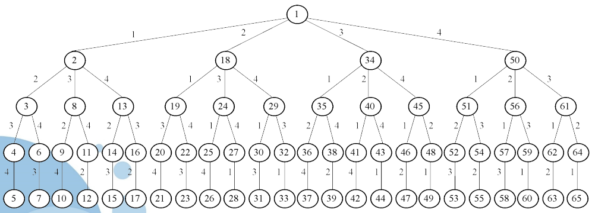​

‍

【搜索解空间树】

‍

解n后问题的回溯算法可描述如下：

* 求解过程从空配置开始。
* 在第1个~第m个皇后为合理配置的基础上，再配置第m+1个皇后，直至第n个皇后也是合理时，就找到了一个解。
* 在每个皇后的配置上，顺次从第一行到第n行配置，当第n行也找不到一个合理的配置时，就要回溯，去改变前一个皇后的配置。

‍

【解向量】用n元组$x[1:n]$表示n皇后问题的解，$x[i]$表示皇后i放在第i行的第$x[i]$列上，用完全n叉树表示解空间。

‍

【剪枝函数设计】对于两个皇后$A(i, x[i]), B(k, x[k])$

* 两个皇后不同行：$i \ne k$
* 两个皇后不同列：$x[i] \ne x[k]$
* 两个皇后不同一条斜线：$|i-k| \ne |x[i]-x[k]|$

‍

【算法描述】

‍

递归回溯算法

```python
def queen_b(n):
   x = [-1]*n
   sum_ = [0]

   def backtrack(t):
      if t >= n and n > 0:
         sum_[0] += 1
      else:
         for i in range(n):
            x[t] = i
            flag = True
            for j in range(t):
               if x[j] == x[t] or abs(x[j] - x[t]) == abs(t - j):
                  flag = False
                  break
            if flag:
               backtrack(t + 1)
   backtrack(0)
   return sum_[0]
```

‍

非递归迭代回溯算法

```python
def queen(n):
   x = [-1]*n
   sum_ = 0
   t = 0

   def place(k):
      for j in range(k):
         if x[j] == x[k] or abs(x[j] - x[k]) == abs(k - j):
            return False
      return True
   while t >= 0:
      x[t] += 1
      while x[t] < n and not place(t):
         x[t] += 1
      if x[t] < n:
         if t == n - 1:
            sum_ += 1
         else:
            t += 1
            x[t] = -1
      else:
         t -= 1
   return sum_
```

‍

‍

‍

### 子集和

‍

‍

给定n个不同的正数集$W = \{w_i | 1 \le i \le n\}$和正数M，要求找出正数集W子集S，使该子集中所有元素的和为M，即$\sum_{n \in S} w_i = C$

  

【定义问题的解空间】

子集和问题是从n个元素的集合中找出满足某种性质的子集，其相应的解空间树为子集树。  
该问题的另一种表示是，每个解的子集由这样一个n元组$(x_1, x_2, ..., x_n)$表示，其中$x_i \in \{0, 1\}, 1 \le i \le n$。如果解中含有$w_i$，则令$x_i = 1$，否则$x_i = 0$。

‍

【搜索解空间树】

使用递归回溯的方法来构造最优解，设cs为当前子集和，在解空间树中进行搜索时，

- 若当前层$i &gt; n$时，算法搜索至叶节点，其相应的子集和为cs。当$cs = c$，则找到了符合条件的解。
- 当$i \le n$时，当前扩展结点Z是子集树的内部结点。该结点有$x[i] = 1$和$x[i] = 0$两个儿子结点。其左儿子结点表示$x[i] = 1$的情形。

‍

```python
def subsum(w, C):
   res = []
   x = []

   def backtrack(i):
      if i >= len(w):
         res.append(x[:])
         return
      if sum(x + w[i:i+1]) <= C:
         x.append(w[i])
         backtrack(i + 1)
         x.pop()
      if sum(x + w[i+1:]) >= C:
         backtrack(i + 1)
   backtrack(0)
   return res
```

‍

### 简单装载

‍

【问题描述】有n个集装箱要装上一艘载重量为W的轮船，其中集装箱$i ,(1 \le i \le n)$的重量为$w_i$。不考虑集装箱的体积限制，现要从这些集装箱中选出重量和小于等于W并且尽可能大的若干装上轮船。

‍

【问题求解】采用带剪枝的回溯法求解。
求解算法如下：`void dfs(int i, int tw, int rw, int op[])`
其中参数i表示考虑的集装箱i，tw表示选择的集装箱重量和，rw表示剩余集装箱的重量和（初始时为全部集装箱重量和），op表示一个解，即对应一个装载方案。最优解：x, maxw

剪枝：

- 左剪枝：仅仅扩展$tw + w[i] \le W$的左孩子结点
- 右剪枝：仅仅扩展$tw + rw - w[i] &gt; maxw$的右孩子结点

‍

‍

```python
def simpleload(w, W):
   n_maxw = [len(w), 0]
   x = [-1]*n_maxw[0]

   def dfs(i, tw, op):
      if i >= n_maxw[0]:
         if tw > n_maxw[1]:
            n_maxw[1] = tw
            x[:] = op[:]
         return
      if tw + w[i] <= W:
         op[i] = 1
         dfs(i+1, tw+w[i], op)
      if tw + sum(w[i+1:]) > n_maxw[1]:
         op[i] = 0
         dfs(i+1, tw, op)
   dfs(0, 0, [-1]*n_maxw[0])
   return [v for i, v in enumerate(w) if x[i] == 1]
```

‍

‍

### 活动安排

‍

【问题描述】同上

‍

【问题求解】调度方案（一种排列）：$x[1], x[2], ..., x[n]$

- 采用回溯法求解，相当于找到$S = \{1, 2, ..., n\}$的某个排列即调度方案，使得其中所有兼容活动个数最多，显然对应的解空间是一个是排列树。
- 直接采用排列树递归框架实现，对于每一种调度方案求出所有兼容活动个数，通过比较求出最多活动个数maxsum，对应的调度方案就是最优调度方案bestx，即为本问题的解。

‍

对于一种调度方案，如何计算所有兼容活动的个数呢？因为其中可能存在不兼容的活动。

|活动编号|1|2|3|4|
| ---------------------------------------------------------------------------------| ---| ---| ---| ----|
|开始时间|1|2|4|6|
|结束时间|3|5|8|10|
|例如，上表的4个活动，若调度方案为（1，2，3，4），求所有兼容活动个数的过程如下：|||||

1. 置当前活动的结束时间laste=0，所有兼容活动个数sum=0。
2. 活动1：其开始时间为1，大于等于laste，属于兼容活动，选取它，sum增加1，sum=1，置laste=其结束时间=3。
3. 活动2：其开始时间为2，小于laste，属于非兼容活动，不选取它。
4. 活动3：其开始时间为4，大于等于laste，属于兼容活动，选取它，sum增加1，sum=2，置laste=其结束时间=8。
5. 活动4：其开始时间为6，小于laste，属于非兼容活动，不选取它。
6. 该调度方案的所有兼容活动个数sum为2。

‍

求解过程

- 产生所有排列，每个排列$x = (x_1, x_2, ..., x_n)$对应一种调度方案
- 计算每种调度方案的兼容活动个数sum
- 比较求出最大的兼容活动个数maxsum和最优方案bestx

‍

```python
def active(a):
   n_sum_maxsum_laste = [len(a), 0, 0, 0]
   bestx = [-1]*n_sum_maxsum_laste[0]
   x = [_ for _ in range(n_sum_maxsum_laste[0])]

   def dfs(i):
      if i >= n_sum_maxsum_laste[0]:
         if n_sum_maxsum_laste[1] > n_sum_maxsum_laste[2]:
            n_sum_maxsum_laste[2] = n_sum_maxsum_laste[1]
            bestx[:] = x[:]
         return
      for j in range(i, n_sum_maxsum_laste[0]):
         x[i], x[j] = x[j], x[i]
         sum_tmp, laste_tmp = n_sum_maxsum_laste[1], n_sum_maxsum_laste[3]
         if a[x[j]][0] >= n_sum_maxsum_laste[3]:
            n_sum_maxsum_laste[1] += 1
            n_sum_maxsum_laste[3] = a[x[j]][1]
         dfs(i+1)
         x[i], x[j] = x[j], x[i]
         n_sum_maxsum_laste[1], n_sum_maxsum_laste[3] = sum_tmp, laste_tmp
   dfs(0)
   laste = 0
   res = []
   for j in range(n_sum_maxsum_laste[0]):
      if a[bestx[j]][0] >= laste:
         res.append((bestx[j], a[bestx[j]][0], a[bestx[j]][1]))
         laste = a[bestx[j]][1]
   return res
```

【算法分析】该算法对应解空间树是一棵排列树，与求全排列算法的时间复杂度相同，即为$O(n!)$。

‍

‍

‍

# 分限

‍

    类似于回溯法，也是一种**在问题的解空间树上搜索**问题解的算法, 但在一般情况下，回溯法的求解目标是找出解空间树中**满足约束条件的所有解**，而分枝限界法的求解目标则是找出满足约束条件的**一个解**，或是在解中找出使**某一**目标函数值达到极大或极小的解，即**最优解**

‍

### Tips

    分支限界算法=广度优先搜索+剪枝策略

‍

## 原理

‍

    采用广度优先的策略，依次搜索活结点的所有分枝; 同时采用一个限界函数，计算限界函数值，选择一个最有利的子结点作为扩展结点，使搜索朝着解空间树上有最优解的分枝推进，以便尽快地找出一个最优解。

‍

### 搜索解空间树过程

‍

1. 将根结点加入队列中, 从队列中取出首结点成为当前扩展结点
2. 产生当前扩展结点的所有孩子结点；
3. 在产生的孩子结点中，抛弃那些不可能产生可行解或最优解的结点；
4. 将其余的孩子结点加入活结点表；
5. 从活结点表中选择下一个活结点作为新的扩展结点。

‍

‍

## 区别与联系

‍

### **与回溯法比较**

‍

==相同点==

1. 均需要先**定义问题的解空间**，确定的解空间组织结构一般都是树或图, 然后在问题的解空间树上搜索问题解。
2. 搜索前均需确定**判断条件**用于判断扩展生成的结点是否为可行结点。
3. 搜索过程中必须判断扩展生成的结点是否满足判断条件，如果满足，则**保留**该扩展生成的结点，否则舍弃。

‍

==不同点==

1. 搜索目标：  
    回溯法- 所有解，分支限界- 一个解(最优解)
2. 搜索方式：  
    回溯法- 深度优先, 分支限界法- 广度优先 或 最小耗费优先
3. 扩展方式：  
    回溯法- 一次生成**一个**孩子结点，分支限界法- 一次生成**所有**孩子结点

‍

|方法|解空间搜索方式|存储结点的数据结构|结点存储特性|常用应用|
| ------------| ----------------| ------------------------------------| --------------------------------------------| ----------------------------------------|
|回溯法|深度优先|栈|活结点的所有可行子结点被遍历后才从栈中出栈|找出满足条件的所有解|
|分枝限界法|广度优先|队列，优先队列（堆（大根or小根））|每个结点只有一次成为活结点的机会|找出满足条件一个解或者特定意义的最优解|

‍

‍

## 性能

‍

    一般情况下，在问题的解向量$X = (x_1, x_2, ..., x_n)$中，分量$X_i ,(1 \le i \le n)$的取值范围为某个有限集合$S_i = (s_{i1}, s_{i2}, ..., s_{ir})$。

问题的解空间由笛卡尔积$S_1 \times S_2 \times ... \times S_n$构成：

* 第1层根结点有$|S_1|$棵子树
* 第2层有$|S_1|$个结点，第2层的每个结点有$|S_2|$棵子树，第3层有$|S_1| \times |S_2|$个结点
* ...
* 第n+1层有$|S_1| \times |S_2| \times ... \times |S_n|$个结点，它们都是叶子结点，代表问题的所有可能解
* 在最坏情况下，时间复杂性是指数阶。

‍

## 使用

‍

简单来看

1. 定义问题的解空间
2. 确定问题的解空间组织结构（树或图）
3. 搜索解空间。搜索前要定义判断标准（约束函数或限界函数），如果选用优先队列式分支限界法，则必须确定优先级。

‍

### 流程

‍

#### 1 设计限界函数

‍

    在搜索解空间树时，每个活结点可能有很多孩子结点，其中有些孩子结点搜索下去不可能产生解。可以设计好的限界函数在扩展时删除这些不必要的孩子结点，从而提高搜索效率。

‍

#### 2 组织活结点表

‍

（根据选择下一个扩展结点的方式来组织活结点表，不同的活结点表对应不同分枝搜索方式）

‍

1. ==队列式==分枝限界法

    （将活结点表组织成一个队列，并按照**队列先进先出（FIFO）原则**选取扩展结点）

    1. 将根结点加入活结点队列。
    2. 从活结点队中取出队头结点，作为当前扩展结点。
    3. 对当前扩展结点，先从左到右地产生它的所有孩子结点，用约束条件检查，把所有满足约束条件的孩子结点加入活结点队列。
    4. 重复步骤2和3，直到找到一个解或活结点队列为空为止。
2. ==优先队列式==分枝限界法

    （将活结点表组组成一个优先队列，并选取**优先级最高的活结点**成为当前扩展结点）

    1. 计算起始结点（根结点）的优先级并加入优先队列
    2. 从优先队列中取出优先级最高的结点作为当前扩展结点（成为队头），使搜索朝着解空间树上可能有最优解的分枝推进，以便尽快地找出一个最优解。
    3. 对当前扩展结点，先从左到右地产生它的所有孩子结点，然后用约束条件检查，对所有满足约束条件的孩子结点计算优先级并加入优先队列。
    4. 重复步骤2和3，直到找到一个解或优先队列为空为止。

‍

#### 3 确定最优解的解向量

‍

类似数据结构的最短路径问题, 用Path数组存储路径就可以了

1. 每个扩展结点保存从根结点到该结点的**路径**

        每个结点带有一个可能的解向量。比较浪费空间，但实现起来简单
2. 搜索过程中构建搜索经过的**树结构**

        每个结点通过双亲指针找到对应的最优解向量。这种做法需保存搜索经过的**树结构**，每个结点增加一个指向双亲结点的指针。

‍

‍

> 优先队列：
> 优先队列是利用堆来实现的，堆可以看作一棵完全二叉树的顺序存储结构。在这棵完全二叉树中，如果每一个节点的值都大于等于左右孩子的值，则称之为最大堆。如果每一个节点的值都小于等于左右孩子的值，则称之为最小堆。
> 两个基本操作：
>
> - 出队：堆顶出队，最后一个记录代替堆顶的位置，自顶向下重新调整为堆。
>   - 出队后，除了堆顶之外，其他节点都满足最大堆的定义，只需要将堆顶执行“下沉”操作，即可调整为堆。
>     - “下沉”：堆顶与左右孩子比较，如果比孩子大，则已满足堆；如果比孩子小，则与较大的孩子交换，交换到新的位置后，继续向下比较，从根节点一直比较到叶子。
> - 入队：新记录放入最后一个记录之后，自底向上重新调整为堆。
>   - 入队后除了新入队记录之外，其他节点都满足最大堆的定义，只需要将新记录执行“上浮”操作，即可调整为堆。
>     - “上浮”：新记录与其双亲比较，如果小于等于双亲，则已满足堆；如果比双亲大，则与双亲交换，交换到新的位置后，继续向上比较，从叶子一直比较到根。

‍

### 关键问题

‍

1. 确定合适的限界函数
2. 组织待处理结点表
3. 确定最优解中的各个分量

‍

## 实例

‍

### 0/1背包

‍

    无论采用队列式分枝限界法还是优先队列式分枝限界法求解0/1背包问题，最坏情况下要搜索整个解空间树，所以最坏时间和空间复杂度均为$O(2^n)$，其中n为物品个数。

‍

#### 队列式

‍

1. 首先不考虑限界问题，用FIFO表示队列（实际上对应层次遍历）。初始时，FIFO=[]
2. 设计限界函数，设根结点为第0层，然后各层依次递增，显然$i = n$时表示是叶子结点层
3. 由于该问题是求装入背包的最大价值，属求**最大值问题**，采用**上界设计方式**
4. 对于第i层的某个结点e，用e.w表示结点e时已装入的总重量，用e.v表示已装入的总价值：

    * 如果所有剩余的物品都能装入背包，那么价值的上界$e.ub = e.v + (v[i+1] + ... + v[n])$
    * 如果所有剩余的物品不能全部装入背包，那么价值的上界$e.ub = e.v + (v[i+1] + ... + v[k]) + (物品_{k+1}装入的部分重量) \times 物品_{k+1}的单位价值$
5. 在结点进队时判断是否为叶子结点：

    在结点进队时判断是否为叶子结点：

    * 叶子结点对应一个解，叶子结点没有真正进队，作寻找最优解和构造输出解的操作
    * 叶子结点不再扩展

‍

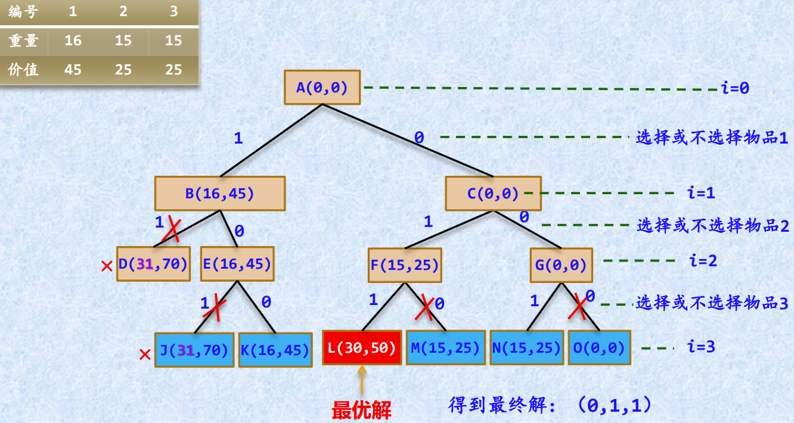

‍

```python
class E():
   def __init__(self, i, w, v, no, x):
      self.i = i
      self.w = w
      self.v = v
      self.no = no
      self.x = x
      self.ub = 0

def bb01bag(w, v, W):
   n = len(w)
   bestx = []
   maxv = [0]
   def bound(e):
      i = e.i+1
      sumw = e.w
      sumv = e.v
      while i < n and sumw+w[i] <= W:
         sumw += w[i]
         sumv += v[i]
         i += 1
      e.ub = sumv + (W-sumw)*v[i-1]/w[i-1] if i < n else sumv
   def enqueue(e, qu):
      if e.i == n:
         if e.v > maxv[0]:
            maxv[0] = e.v
            bestx[:] = e.x[:]
      else:
         qu.append(e)
   qu = []
   total = 1
   e = E(0, 0, 0, total, [])
   total += 1
   bound(e)
   qu.append(e)
   while qu:
      e = qu.pop(0)
      if e.w + w[e.i] <= W:
         e1 = E(e.i+1, e.w+w[e.i], e.v+v[e.i], total, e.x[:]+[1])
         total += 1
         bound(e1)
         enqueue(e1, qu)
      e2 = E(e.i+1, e.w, e.v, total, e.x[:]+[0])
      total += 1
      bound(e2)
      if e2.ub > maxv[0]:
         enqueue(e2, qu)
   return bestx
```

‍

‍

#### 优先队列式

‍

一般的队列改为优先队列  

用大根堆表示活结点表，取优先级为活结点所获得的价值

‍

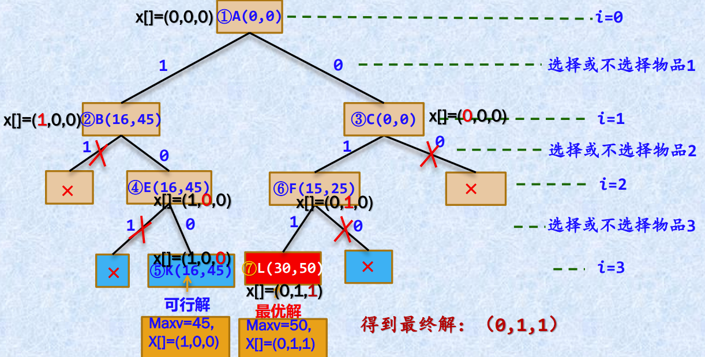

‍

```python
class E():
   def __init__(self, i, w, v, no, x):
      self.i = i
      self.w = w
      self.v = v
      self.no = no
      self.x = x
      self.ub = 0
   def __lt__(self, other):
      return self.ub > other.ub

def bb01bag(w, v, W):
   n = len(w)
   bestx = []
   maxv = [0]
   def bound(e):
      i = e.i+1
      sumw = e.w
      sumv = e.v
      while i < n and sumw+w[i] <= W:
         sumw += w[i]
         sumv += v[i]
         i += 1
      e.ub = sumv + (W-sumw)*v[i-1]/w[i-1] if i < n else sumv
   def enqueue(e, qu):
      if e.i == n:
         if e.v > maxv[0]:
            maxv[0] = e.v
            bestx[:] = e.x[:]
      else:
         qu.put(e)
   qu = PriorityQueue()
   total = 1
   e = E(0, 0, 0, total, [])
   total += 1
   bound(e)
   qu.put(e)
   while not qu.empty():
      e = qu.get()
      if e.w + w[e.i] <= W:
         e1 = E(e.i+1, e.w+w[e.i], e.v+v[e.i], total, e.x[:]+[1])
         total += 1
         bound(e1)
         enqueue(e1, qu)
      e2 = E(e.i+1, e.w, e.v, total, e.x[:]+[0])
      total += 1
      bound(e2)
      if e2.ub > maxv[0]:
         enqueue(e2, qu)
   return bestx
```

‍

‍

### 单源最短路径

‍

    给定一个带权有向图$G =(V, E)$，其中每条边的权是一个正整数。另外，还给定V中的一个顶点v，称为源点。计算从源点到其他所有顶点的最短路径长度。这里的长度是指路上各边权之和。

‍

#### 队列式

‍

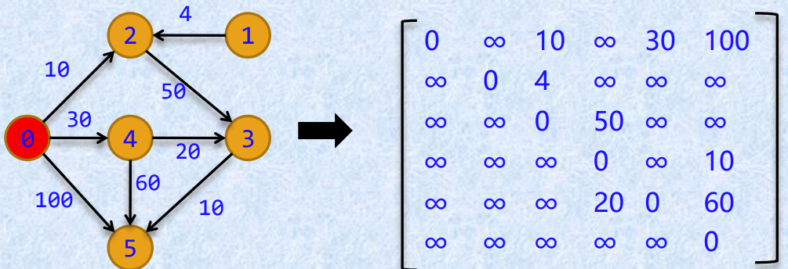

用dist数组存放源点v出发的最短路径长度，$dist[i]$表示源点v到顶点i的最短路径长度，初始时所有$dist[i]$值为$\infty$。

用prev数组存放最短路径，$prev[i]$表示源点v到顶点i的最短路径中顶点i的前驱顶点。

‍

#### 优先队列式

‍

这里采用`queue.PriorityQueue`容器作为优先队列。

```python
def sss(a, v):  # 图的邻接矩阵，起点
   n = len(a)
   dist = [math.inf]*n  # 源点到顶点i的最短路径长度
   prev = [v]*n  # 源点到j的最短路径中顶点j的前驱顶点
   qu = PriorityQueue()
   e = [0, v]
   qu.put(e)
   dist[v] = 0
   while not qu.empty():
      e = qu.get()
      for j in range(n):
         if a[e[1]][j] < math.inf and e[0]+a[e[1]][j] < dist[j]:
            dist[j] = e[0] + a[e[1]][j]
            prev[j] = e[1]
            print(prev)
            print(dist)
            e1 = (dist[j], j)
            qu.put(e1)
   res = {}
   for i, d in enumerate(dist):
      if d == math.inf:
         res[i] = '无法到达'
         continue
      res[i] = [i]
      while res[i][-1] != v:
         res[i].append(prev[res[i][-1]])
      res[i].reverse()
      res[i] = (d, res[i])
   return res
```

‍

# 随机

‍

    随机算法也叫概率算法，允许算法在执行过程中随机地选择下一个计算步骤。在很多情况下，算法在执行过程中面临选择时，随机性选择比最优选择省时，因此概率算法可以在很大程度上降低算法的复杂度。

    概率算法的一个基本特征是对所求解问题的同一实例用同一概率算法求解两次可能得到完全不同的效果。而这两次求解所需的时间甚至所得到的结果可能会有相当大的差别。

‍

对概率算法通常讨论如下两种期望时间：

1. 平均的期望时间：所有输入实例上平均的期望执行时间。
2. 最坏的期望时间：最坏的输入实例上的期望执行时间。

‍

分类

- 数值概率算法：常用于**数值问题**的求解，这类算法所得到的往往是近似解，而且近似解的精度随计算时间的增加不断提高。
- 蒙特卡罗（Monte Carlo）算法：用蒙特卡罗算法能够求得问题的一个解，但这个解**未必是正确的。**
- 拉斯维加斯（Las Vegas）算法：一旦用拉斯维加斯算法**找到一个解，那么这个解肯定是正确的**，但有时用拉斯维加斯算法**可能找不到**解。
- 舍伍德（Sherwood）算法：**总能求得**问题的一个解，且所求得的解**总是正确**的。

‍

* 数值随机算法(略)

  1. 常用于数值问题的求解；
  2. 所得到的往往是近似解；
  3. 近似解的精度随计算时间的增加而不断提高；
  4. 许多情况下，计算问题的精确解是不可能或没有必要的，因此用数值概率算法可得到相当满意的解。
* 舍伍德算法

  1. 总能求得问题的一个解；
  2. 所求的解总是正确的；
  3. 当一个确定性算法在最坏情况下的计算复杂性与其在平均情况下的计算复杂性有较大差别时，可引入随机性，把它改造成舍伍德算法；
  4. 精髓：不是避免算法的最坏情况行为，而是设法消除这种最坏情形行为与特定实例之间的关联性。
* 拉斯维加斯算法

  1. 不会得到不正确的解；
  2. 有时可能会找不到解；
  3. 正确解的概率随着计算时间的增加而提高；
  4. 对于所求解问题的任一实例，用同一拉斯维加斯算法反复对该实例求解足够多次，可使求解失效的概率任意小。
* 蒙特卡罗算法

  1. 用于求问题的准确解；
  2. 能求得一个解，但这个解未必正确；
  3. 算法所用时间越多，正确解概率越高；
  4. 缺点：一般情况下，无法有效判定所得到的解是否肯定正确。

‍

‍

## 随机数发生器

‍

    在概率算法中需要由一个随机数发生器产生**随机数序列**，以便在算法执行中按照这个随机数序列**进行随机选择**。可以采用**线性同余法**产生随机数序列$a_0, a_1, ..., a_n$：

$$
\begin{align*}
a_0 &= d \\
a_n &= (b a_{n-1} + c) \space mod \space m
\end{align*}
$$

其中，$b \ge 0, c \ge 0, d \le m$，d称为随机数发生器的随机种子。

‍

‍

‍

‍

## 拉斯维加斯

‍

    显著特征是，它所做的随机性选择有可能导致算法找不到问题的解，即算法运行一次，或者得到一个正确的解，或者无解。因此需要对同一输入实例反复多次运行算法，直到成功地获得问题的解。

‍

### 基本思想

‍

* 拉斯维加斯算法属于随机算法中的一种，它不会得到不正确的解，一旦用拉斯维加斯算法找到一个解，那么这个解肯定是正确的，但算法的时间复杂度是非确定的。
* 运气好时可瞬间求出解，运气差时需要很长一段时间。该算法的运行过程几乎全靠运气，这也是该算法以==赌城“拉斯维加斯”来命名==的原因。

‍

### 使用

‍

    用一个返回值类型为bool的函数表示拉斯维加斯型算法。当算法找到一个解时返回true，否则返回false

‍

    `bool success = LV(x, y)`​​

‍

    其中x是输入参数；当success的值为true时，y返回问题的解；当success值为false时，算法未能找到问题的解。此时可对同一实例再次独立地调用相同的算法。

‍

### 性能

‍

设x代表具体实例，定义：

* $p(x)$：调用LV算法获得问题的一个解的概率。一个正确的LV算法应该有$p(x) > 0$
* $t(x)$：算法Obstinate找到一个解所需的平均时间
* $s(x)$：求解成功所需的平均时间
* $e(x)$：求解失败所需的平均时间
* 则有公式：$t(x) = p(x)s(x) + (1 - p(x))(e(x) + t(x))$  
  解此方程可得：$t(x) = s(x) + \frac{1 - p(x)}{p(x)}e(x)$

当求解失败时还要继续找问题的解，所以要加$t(x)$  

‍

‍

### 实例

‍

#### 标识重复元素

‍

【问题描述】设有n个元素保存在一维数组a中，其中有n/2个元素各不相同，而另外n/2个元素值相同，因此，数组中总共有(n/2)+1种不同的元素值。算法的目标是要找出数组中的重复元素。

【问题分析】使用随机数发生器，它能够保证从$[0, n-1]$个下标中选取每个值的概率是相等的，等于1/n。
采用随机算法的实现十分简单，它使用随机数发生器，选择两个下标i和j，如果$i != j, a[i] == a[j]$，则算法成功终止。但算法也可能在运行很长时间后仍不能找到重复元素，此算法在找到重复元素前不会终止。此算法如果终止，就一定能得到正确的结果，因此它是一个拉斯维加斯算法。

```python
def elment(a, n):
   while True:
      x = random.randint(0, len(a))
      y = random.randint(0, len(a))
      if x != y and a[x] == a[y]:
         return a[x]
```

‍

#### N皇后问题

‍

一个重要事实：对于n后问题的任何一个解而言，每一个皇后在棋盘上的位置无任何规律，不具有系统性，而更像是随机放置的。

在棋盘上相继的各行中随机的放置皇后，并注意新放置的皇后与已放置的皇后互不攻击，直至n个皇后均已相容地放置好，或已没有下一个皇后的可放置位置时为止。

‍

```cpp
#include <iostream>
using namespace std;
int randd(int n) {
   return rand() % n;
}

class Queen {
   friend void nQueen(int);

private:
   bool Place(int k);   //测试皇后k置于第x[k]列的合法性
   bool QueensLV(void); //随机放置n个皇后拉斯维加斯算法
   int n;               //皇后个数
   int *x;              //解向量
};

bool Queen::Place(int k) { //测试皇后k置于第x[k]列的合法性
   for (int j = 1; j < k; j++)
      if ((abs(k - j) == abs(x[j] - x[k])) || (x[j] == x[k]))
         return false;
   return true;
}

bool Queen::QueensLV(void) { //随机放置n个皇后的拉斯维加斯算法
   int k = 1;
   int count = 1;
   while ((k <= n) && (count > 0)) {
      count = 0;
      int j = 0;
      for (int i = 1; i <= n; i++) {
         x[k] = i;
         if (Place(k))
            if (randd(++count) == 0)
               j = i; //随机位置
      }
      if (count > 0)
         x[k++] = j;
   }
   return (count > 0); // count>0表示成功放置
}
void nQueen(int n) {
   Queen x;
   //初始化x
   x.n = n;
   int *p = new int[n + 1];
   for (int i = 0; i <= n; i++)
      p[i] = 0;
   x.x = p;
   //反复调用随机放置n个皇后的拉斯维加斯算法，直至放置成功
   while (!x.QueensLV());
   for (int i = 1; i <= n; i++)
      cout << p[i] << " ";
   delete[] p;
}

int main(int argc, char const *argv[]) {
   srand(time(NULL));
   nQueen(8);
   return 0;
}
```

‍

与回溯法相结合：

    上述算法一旦发现无法再放置下一个皇后，就要全部重新开始。如果将上述随机放置策略与回溯法相结合，可能会获得更好的效果。

    我们可以先在棋盘的若干行中随机地放置皇后，然后在后继行中用回溯法继续放置，直至找到一个解或宣告失败。随机放置的皇后越多，后继回溯搜索所需的时间就越少，但失败的概率也就越大。(赌徒啊)

‍

```cpp
class Queen {
   friend void nQueen(int);

private:
   bool Place(int k);            //测试皇后k置于第x[k]列的合法性
   void Backtrack(int t);        //★解n后问题的回溯法
   bool QueensLV(int stopVegas); //★随机放置n个皇后的拉斯维加斯算法
   int n, *x, *y;
};

bool Queen::Place(int k) { //测试皇后k置于第x[k]列的合法性
   for (int j = 1; j < k; j++)
      if ((abs(k - j) == abs(x[j] - x[k])) || (x[j] == x[k]))
         return false;
   return true;
}

void Queen::Backtrack(int t) {
   if (t > n) { // t来记当前已经放置的皇后数
      for (int i = 1; i <= n; i++)
         y[i] = x[i];
      return;
   } //已找到一个解并复制给y.
   else {
      for (int i = 1; i <= n; i++)
         x[t] = i;
      if (Place(t))
         Backtrack(t + 1);
   }
}

bool Queen::QueensLV(int stopVegas) { //随机放置n个皇后的拉斯维加斯算法
   int k = 1;
   int count = 1;
   // 1≤stopVegas≤n表示允许随机放置的皇后数
   while ((k <= stopVegas) && (count > 0)) {
      count = 0;
      int j = 0;
      for (int i = 1; i <= n; i++) {
         x[k] = i;
         if (Place(k))
            if (randd(++count) == 0)
               j = i; //随机位置
      }
      if (count > 0)
         x[k++] = j;
   }
   return (count > 0); // count>0表示成功放置
}

void nQueen(int n) { //与回溯法相结合的解n后问题的拉斯维加斯算法
   Queen x;
   x.n = n;
   int *q = new int[n + 1];
   int *p = new int[n + 1];
   for (int i = 0; i <= n; i++) {
      p[i] = 0;
      q[i] = 0;
   }
   x.x = q;
   x.y = p;
   int stop = 5;
   while (!x.QueensLV(stop));
   x.Backtrack(stop + 1);
   for (int i = 1; i <= 5; i++)
      cout << p[i] << " ";
   cout << endl;
   delete[] p;
   delete[] q;
}
```

‍

‍

## 舍伍德

‍

    在分析确定性算法的平均时间复杂性时，通常假定算法的输入实例满足某一特定的概率分布。事实上，很多算法对于不同的输入实例，其**运行时间差别很大**。此时，可以采用舍伍德型概率算法来消除算法的时间复杂性与输入实例间的这种联系。

**​  ​**  在确定性算法中引入随机性

‍

### 实例

‍

#### 快排

‍

    快速排序算法的核心在于选择合适的划分基准。舍伍德型概率算法在快速排序的一次划分之前，根据随机数在待划分序列中**随机确定**一个元素作为基准，并把它与第一个元素交换，则一次划分后得到期望均衡的两个子序列。从而使算法的行为不受待排序序列的不同输入实例的影响，使快速排序在最坏情况下的时间性能趋近于平均情况的时间性能即$O(n \log_2 n)$。

‍

```python
def partition(a, s, t):  # 一次划分算法
   tmp = a[s]  # 用序列的第1个记录作为基准
   while s != t:  # 从序列两端交替向中间扫描，直至s=t为止
      while s < t and tmp <= a[t]:
         t -= 1
      a[s] = a[t]
      while s < t and a[s] <= tmp:
         s += 1
      a[t] = a[s]
   a[s] = tmp
   return s

def quicksort(a, s, t):  # 对a[s..t]元素序列进行递增排序
   if s < t:  # 序列内至少存在2个元素的情况
      j = random.randint(s, t)  #★ 产生[s,t]的随机数j
      a[j], a[s] = a[s], a[j]  #★ 将j和s位置的元素交换
      p = partition(a, s, t)
      quicksort(a, s, p - 1)  # 对左子序列递归排序
      quicksort(a, p + 1, t)  # 对右子序列递归排序
```

  
其优点是其计算时间复杂性对所有实例而言相对均匀，但与其相应的确定性算法相比，其平均时间复杂度没有改进。

上述舍伍德型选择算法对确定性算法所做的修改非常简单且容易实现。但有时所给的确定性算法无法直接改造成舍伍德算法。此时可借助于随机预处理技术，不改变原有的确定性算法，仅对其输入进行随机洗牌，同样可收到舍伍得算法的效果。

  
例如，对于确定性选择算法，我们可用下面的洗牌算法shuffle将数组a中的元素进行排列，然后用确定性算法求解。这样做的效果与舍伍德型算法的效果是一样的。

```python
def shuffle(a):
   for i in range(len(a)):
      j = random.randint(0, len(a) - 1)
      a[i], a[j] = a[j], a[i]
   return a
```

‍

‍

## 蒙特卡罗

‍

    以概率统计理论为指导的数值计算方法，使用随机数（或更常见的伪随机数）来解决问题。基本思想是通过大量的随机抽样来模拟或近似一个复杂的系统或过程，从而得到所要求的结果或特征

‍

‍

解决的问题主要有两类：

1. 确定性的数学问题：如计算多重积分、求逆矩阵、解线性方程组、解积分方程、偏微分方程等。解决方法：间接模拟方法。建立相关问题的概率模型；对模型进行随机抽样；用随机抽样的算术平均值作为近似估计值。
2. 随机性问题：如原子核物理问题、运筹学中的优化问题、随机服务系统中的排队问题、动物的生态竞争和传染病的蔓延等。解决方法：一般情况下都采用直接模拟方法。即根据实际物理情况的概率法则，用计算机进行抽样检验。

‍

‍

### 使用

‍

1. 建模：对求解的问题建立简单而又便于实现的概率统计模型 ，使所求的解恰好是所建立的的概率分布或数学期望；
2. 改进模型：根据概率统计模型的特点和计算实践的需要，尽量改进模型，以便减少方差和降低费用，提高计算效率；
3. 模拟试验：建立对随机变量的抽样方法，其中包括建立伪随机数的方法和建立对所遇到的分布产生随即变量的随机抽样方法；
4. 求解：给出获得所求解的统计估计值及其方差或标准误差的方法。

‍

比较通俗的解释大概是bing说的

1. 首先，根据问题的特点，建立一个合适的概率模型或随机过程，使得问题的解可以用模型或过程的某些参数或数字特征来表示，比如概率、期望值、积分值等。
2. 然后，使用随机数生成器产生大量符合模型或过程分布的随机数或随机样本，这些随机数或样本可以看作是模拟或实验的结果。
3. 最后，使用统计方法对随机数或样本进行分析，计算出所需的参数或数字特征，并作为问题的近似解。通常，随机数或样本越多，近似解越接近真实解。

‍

### 性能

‍

1. 蒙特卡罗方法及其程序结构简单，但计算量大；
2. 收敛的概率性和收敛速度与问题维数无关，模拟结果具有随机性；
3. 蒙特卡罗方法的适应性很强。

‍

有些蒙特卡罗算法除了具有描述问题实例的输入参数外，还具有描述错误解可接受概率的参数。这类算法的计算时间复杂性通常由问题的实例规模以及错误解可接受概率的函数来描述。

‍

### 实例

‍

#### 积分

‍

通过在积分区域内随机生成点，然后根据点落在被积函数下方的比例来估计积分值。这种方法对于高维度或复杂形状的积分问题特别有效15。

‍

#### 求圆周率π

‍

在边长为2的正方形内有一半径为1的内切圆。向该正方形中投掷n次飞镖，假设飞镖击中正方形中任何位置的概率相同，设飞镖的位置为$(x, y)$，如果有$x^2 + y^2 \le 1$，则落在内切圆中。

  
这里，圆面积为π，正方形面积为4，圆面积与正方形面积比为$π / 4$。若n次投掷中有m次落在内切圆中，则圆面积与正方形面积比可近似为$m / n$，即$\pi / 4 \approx m / n$，或者$\pi \approx 4m / n$。

```python
def pi():
   """
   Calculate pi using the Monte Carlo method.
   """
   inside = 0
   for i in range(1000000):
      x = random.random()
      y = random.random()
      if x*x + y*y < 1:
         inside += 1
   return 4 * inside / 1000000
```

‍

#### 不规则图形面积

‍

1. 把图形放在一个已知面积的矩形内，然后假设图形面积与矩形面积的比例就是图形内部点与矩形内部点的比例。这样，我们就把求图形面积转化为求点的比例。
2. 在矩形内随机生成大量的点，然后判断每个点是否在图形内部。这样，我们就得到了一组模拟图形内外点分布的随机样本。
3. 统计出图形内部点和矩形内部点的个数，并计算出它们的比例。然后就可以用这个比例乘以矩形面积得到图形面积的近似值。通常，点越多，近似值越准确。
